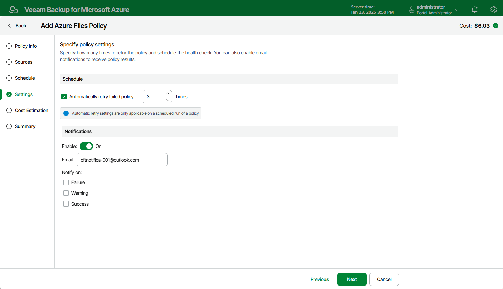

# Step 5. Configure General Settings

At the Settings step of the wizard, you can enable automatic retries and specify notification settings for the backup policy.

Automatic Retry Settings

To instruct Veeam Backup for Microsoft Azure to run the backup policy again if it fails on the first try, do the following:

1. In the Schedule section of the step, select the Automatic retry failed policy check box.
2. In the field to the right of the check box, specify the maximum number of attempts to run the backup policy. The time interval between retries is 600 seconds.

When retrying backup policies, Veeam Backup for Microsoft Azure processes only those Azure file shares that failed to be protected during the previous attempt.

|  |
| --- |
| Note |
| The automatic retry settings apply only to backup policies that run according to specific schedules — these settings do not apply to policies [started manually](backup_policy_start_stop.md). |

Notification Settings

To instruct Veeam Backup for Microsoft Azure to send email notifications for the backup policy, do the following:

1. In the Notifications section of the step, set the Enabled toggle to On.

If you set the toggle to Off, Veeam Backup for Microsoft Azure will not send any notifications for this backup policy — regardless of the configured [global notification settings](configuring_notification_settings.md).

1. In the Email field, specify an email address of a recipient. Use a semicolon to separate multiple recipient addresses.
2. Use the Notify on list to choose whether you want Veeam Backup for Microsoft Azure to send email notifications in case the backup policy completes successfully, completes with warnings or completes with errors.

|  |
| --- |
| Note |
| If you specify the same email recipient in both backup policy notification and [global notification settings](configuring_notification_settings.md), Veeam Backup for Microsoft Azure will override the configured global notification settings and will send each notification to this recipient only once to avoid notification duplicates. |

