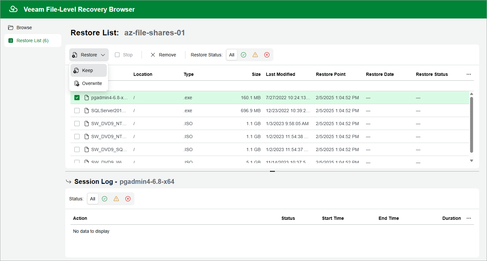

In this article

In the file-level recovery browser, you can find and restore items (files and folders) of the selected Azure file share. All restored items will be saved to the specified file share.

1. On the Browse tab, navigate to a folder that contains the necessary files.
2. In the working area, select check boxes next to the files and click Add to Restore List.
3. Repeat steps 1-2 for all other folders whose files you want to restore.
4. Switch to the Restore List tab, review the list of files and folders, select check boxes next to the items that you want to recover and do the following:

* To restore copies of the selected files and folders to the target file share, click Restore > Keep.

If files and folders with the same names exist on the target file share, Veeam Backup for Microsoft Azure will save the selected files to this file share with the following names — <file\_name>-Copy<ordinal\_number>. Otherwise, Veeam Backup for Microsoft Azure will save the selected files to this file share with the original names.

* To restore the selected files and folders to the target file share, click Restore > Overwrite.

If files and folders with the same names exist on the target file share, Veeam Backup for Microsoft Azure will overwrite these files. Otherwise, Veeam Backup for Microsoft Azure will save the selected files to this file share.

As soon as you click Restore, Veeam Backup for Microsoft Azure will recover the selected files. You can track the progress and view the results of the restore operation in the Session Log section of the Restore List tab.

Page updated 12/1/2023

Page content applies to build 8.0.1.202
