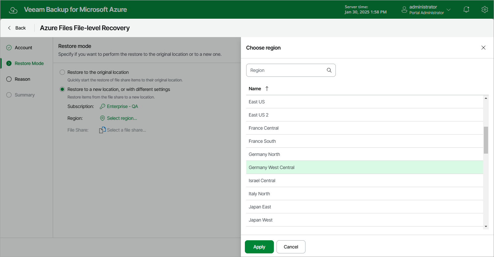

In this article

At the Restore Mode step of the wizard, choose whether you want to restore files of the file share to the original or to a custom location.

If you select the Restore to a new location, or with different settings option, you must also specify the file share that will host the restored files, and select an Azure subscription and an Azure region in which the target file share resides:

1. Click the link in the Subscription field. Then, select the necessary subscription in the Choose subscription window.

For a subscription to be displayed in the list of available subscriptions, it must be [created in Microsoft Azure](https://learn.microsoft.com/en-us/azure/cost-management-billing/manage/create-subscription) and [associated with the Microsoft Entra tenant](https://docs.microsoft.com/en-us/azure/active-directory/fundamentals/active-directory-how-subscriptions-associated-directory) to which the service account specified at [step 2](fs_restore_ui_service_account.md) belongs.

1. Click the link in the Region field. Then, select the necessary Azure region in the Choose region window.
2. Click the link in the File Share field. Then, select the necessary file share in the Choose the target file share window.

For a file share to be displayed in the list of available shares, it must be deployed under the selected subscription in the Microsoft Azure portal, as described in [Microsoft Docs](https://docs.microsoft.com/en-us/azure/storage/files/).

|  |
| --- |
| Note |
| Data transfer to a new location may require additional costs and may take more time to complete. |

Page updated 8/20/2025

Page content applies to build 8.0.1.202
