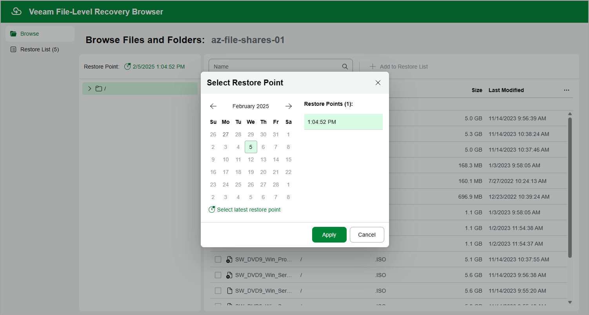

In this article

By default, Veeam Backup for Microsoft Azure uses the most recent valid restore point. However, you can restore files and folders to an earlier state.

To select a restore point in the file-level recovery browser, do the following:

1. On the Browse tab, click the link in the Restore Point field.
2. In the Select Restore Point window, choose a date when the restore point was created, select the necessary restore point from the Restore Points list and click Apply.

Page updated 5/28/2025

Page content applies to build 8.0.1.202
