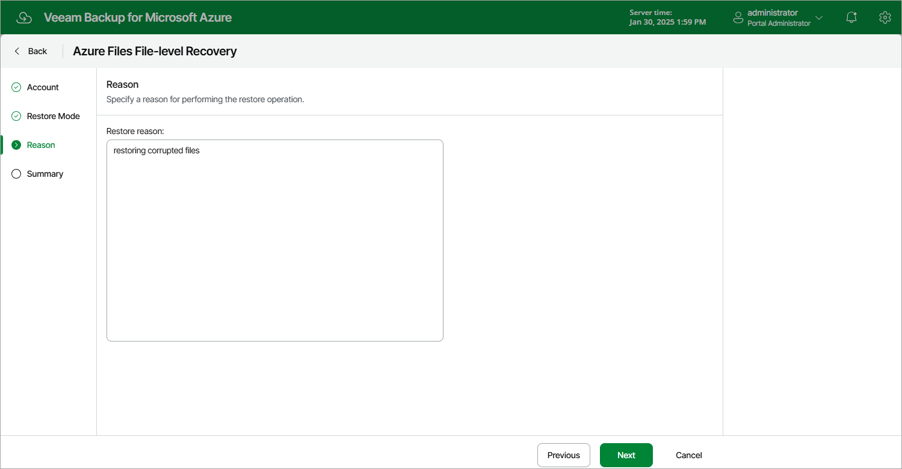

In this article

At the Reason step of the wizard, specify a reason for restoring files and folders. This information will be saved to the session history, and you will be able to reference it later.

Page updated 12/1/2023

Page content applies to build 8.0.1.202
