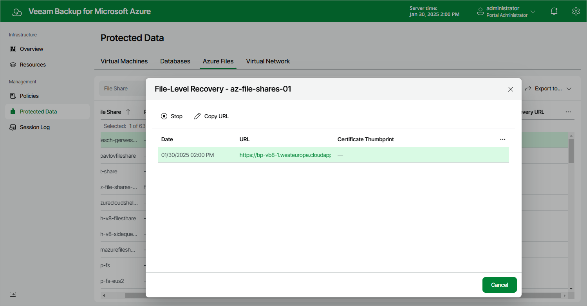

In this article

At the Summary step of the wizard, review summary information and click Start.

As soon as you click Start, Veeam Backup for Microsoft Azure will close the Azure Files File-Level Recovery wizard and start a restore session. You can track the progress of the restore session in the File-Level Recovery window. To open the File-Level Recovery window, navigate to Protected Data and click the link in the File-Level Recovery URL column.

In the URL column of the window, Veeam Backup for Microsoft Azure will display a link to the file-level recovery browser. You can use the link in either of the following ways:

* Click the link to open the file-level recovery browser on your local machine while the restore session is running.
* Copy the link, close the File-Level Recovery window and open the file-level recovery browser on another machine.

Page updated 4/9/2025

Page content applies to build 8.0.1.202
