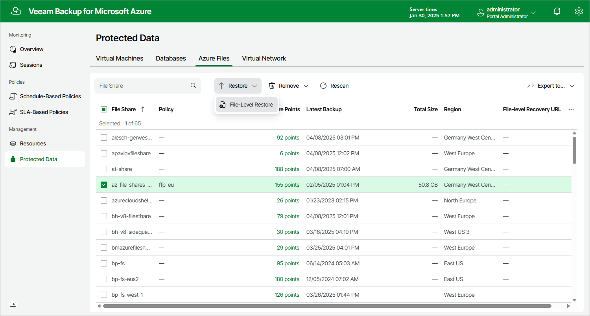

In this article

To launch the Azure Files File-Level Recovery wizard, do the following:

1. Navigate to Protected Data > Azure Files.
2. Select the Azure file share that you want to restore.
3. Click Restore > File-Level Restore.

Page updated 5/28/2025

Page content applies to build 8.0.1.202
