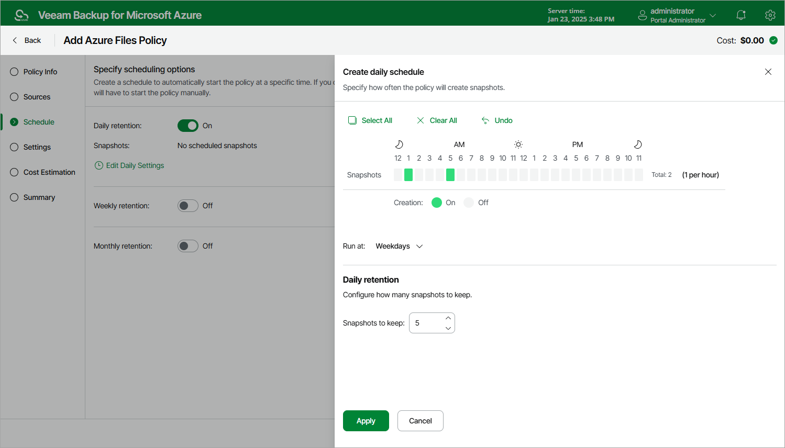

In this article

To create a daily schedule for the backup policy, do the following at the Schedule step of the wizard:

1. Set the Daily retention toggle to On and click Edit Daily Settings.
2. In the Create daily schedule window, select hours when Veeam Backup for Microsoft Azure will create snapshots.

|  |
| --- |
| Note |
| Since Veeam Backup for Microsoft Azure runs retention sessions at 12:15 AM according to the time zone set on the backup appliance, it is not recommended that you schedule backup policies to execute at 12:15 AM. Otherwise, Veeam Backup for Microsoft Azure will not be able to run the retention sessions. |

1. Use the Run at drop-down list to choose whether you want the backup policy to run everyday, on weekdays (Monday through Friday) or on specific days.
2. In the Daily retention section, specify the number of restore points that you want to keep in a snapshot chain.

If the restore point limit is exceeded, Veeam Backup for Microsoft Azure removes the earliest restore point from the chain. For more information, see [File Share Snapshot Retention](file_share_snapshot_retention.md).

1. To save changes made to the backup policy settings, click Apply.

|  |
| --- |
| Tip |
| Veeam Backup for Microsoft Azure will start applying the configured retention settings as soon as the backup policy produces restore points. Even if you disable the daily schedule after the restore points are created, the retention policy will still be applied to these restore points. As a workaround, you can modify the configured retention settings. |

Page updated 7/22/2025

Page content applies to build 8.0.1.202
