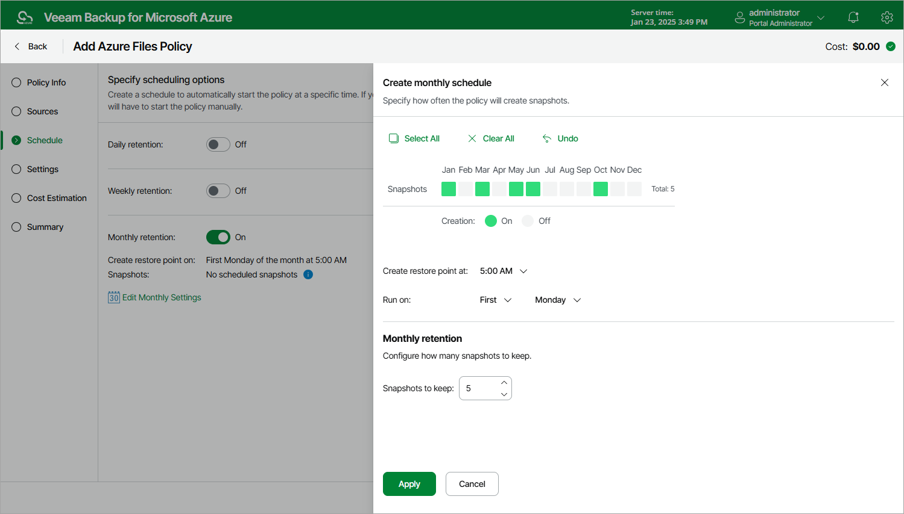

In this article

To create a monthly schedule for the backup policy, do the following at the Schedule step of the wizard:

1. Set the Monthly retention toggle to On and click Edit Monthly Settings.
2. In the Create monthly schedule window, select months when the backup policy will create snapshots.
3. Use the Create restore points at and Run on drop-down lists to schedule a specific time and day for the backup policy to run.
4. In the Monthly retention section, specify the number of restore points that you want to keep in a snapshot chain.

If the restore point limit is exceeded, Veeam Backup for Microsoft Azure removes the earliest restore point from the chain. For more information, see [File Share Snapshot Retention](file_share_snapshot_retention.md).

1. To save changes made to the backup policy settings, click Apply.

|  |
| --- |
| Tip |
| Veeam Backup for Microsoft Azure will start applying the configured retention settings as soon as the backup policy produces restore points. Even if you disable the daily schedule after the restore points are created, the retention policy will still be applied to these restore points. As a workaround, you can modify the configured retention settings. |

Page updated 7/22/2025

Page content applies to build 8.0.1.202
