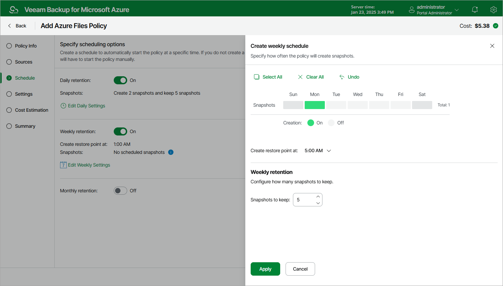

# Specifying Weekly Schedule

To create a weekly schedule for the backup policy, do the following at the Schedule step of the wizard:

1. Set the Weekly retention toggle to On and click Edit Weekly Settings.
2. In the Create weekly schedule window, select days of the week when Veeam Backup for Microsoft Azure will create snapshots.

1. Use the Create restore points at drop-down list to schedule a specific time for the backup policy to run.

1. In the Weekly retention section, specify the number of restore points that you want to keep in a snapshot chain.

If the restore point limit is exceeded, Veeam Backup for Microsoft Azure removes the earliest restore point from the chain. For more information, see [File Share Snapshot Retention](file_share_snapshot_retention.md).

Consider that Veeam Backup for Microsoft Azure prioritizes global retention settings over retention settings configured for backup policies. If snapshots produced by a backup policy are older than the global retention period, these snapshots will be removed anyway. For more information, see [Configuring Global Retention Settings](configuring_global_retention.md).

1. To save changes made to the backup policy settings, click Apply.

|  |
| --- |
| Tip |
| Veeam Backup for Microsoft Azure will start applying the configured retention settings as soon as the backup policy produces restore points. Even if you disable the daily schedule after the restore points are created, the retention policy will still be applied to these restore points. As a workaround, you can modify the configured retention settings. |

