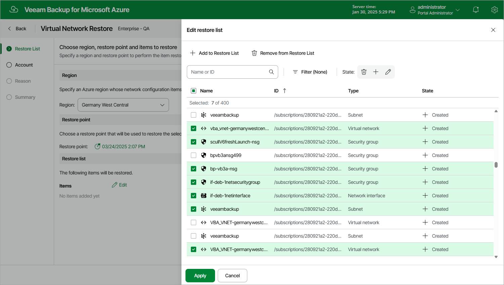

In this article

At the Restore List step of the wizard, select virtual network configuration items you want to restore, and choose an Azure region and a restore point that will be used to restore the selected items. By default, Veeam Backup for Microsoft Azure uses the most recent valid restore point. However, you can restore the virtual network configuration data to an earlier state.

1. To select the region and the restore point:

1. In the Region section, select an Azure region whose network configuration items you want to restore.
2. In the Restore point section, click the link to the right of Restore point.
3. In the Available restore points window, select the necessary restore point and click Apply.

1. To select the virtual network configuration items:

1. In the Items section, click Edit.
2. In the Edit restore list window, click Add to Restore List.
3. In the Items List window, select check boxes next to the items that you want to restore, and click Add.
4. In the Edit restore list window, review the restore list and click Apply.

|  |
| --- |
| Important |
| A resource group that has the same name as the original resource group must exist in the original location. Otherwise, Veeam Backup for Microsoft Azure will not be able to perform the restore operation. |

Page updated 2/2/2024

Page content applies to build 8.0.1.202
