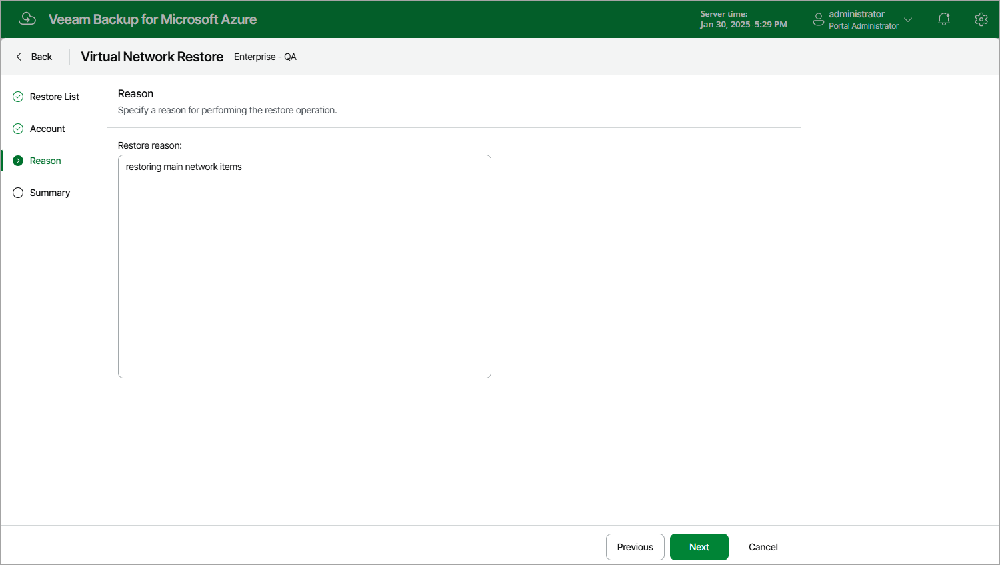

# Step 4. Specify Restore Reason

At the Reason step of the wizard, specify a reason for the restore of virtual network configuration items. The information you provide will be saved in the session history and you can reference it later.

