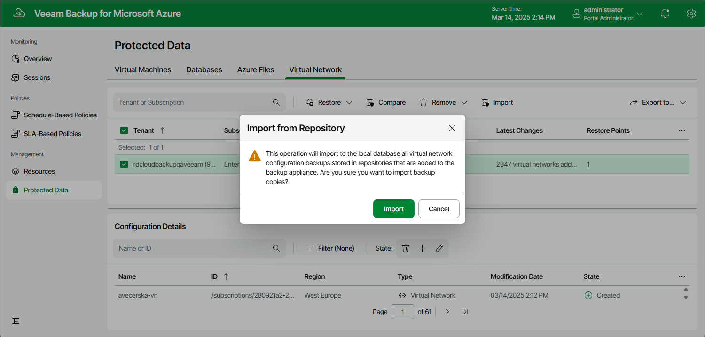

In this article

The Protected Data page only shows configuration records saved to the configuration database of the backup appliance. That is why you can restore virtual network configuration from these records only.

When you add a new repository to your backup appliance, Veeam Backup for Microsoft Azure checks whether any virtual network configuration backups are stored in this repository and then automatically imports all the detected restore points to the configuration database.

You can also manually import any deleted virtual network configuration backups to the local database, in case these backups are still stored in repositories added to the backup appliance. To do that:

1. Navigate to Protected Data > Virtual Network.
2. Click Import. Veeam Backup for Microsoft Azure will update the list of configuration records.

Page updated 3/14/2025

Page content applies to build 8.0.1.202
