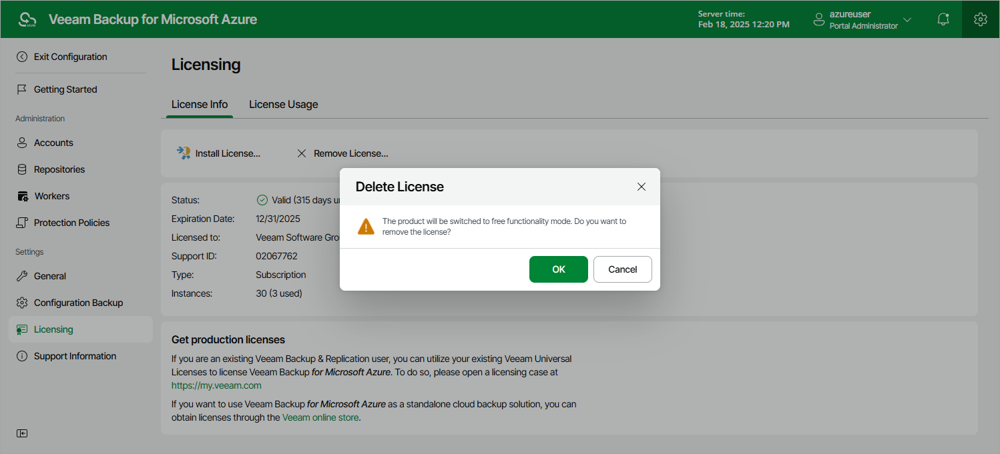

In this article

To remove the license installed on a backup appliance that was previously deployed from the Microsoft Azure Marketplace:

1. Switch to the Configuration page.
2. Navigate to Licensing > License Info.
3. Click Remove License.
4. In the Remove License window, click Yes to confirm that you want to remove the license.

After you remove a license, Veeam Backup for Microsoft Azure will automatically switch back to the Free edition. In this case, according to the FIFO (first-in first-out) queue, only the first 10 instances registered in the configuration database will remain protected. You can revoke license units from these instances as described in section [Revoking License Units](license_revoke.md).

|  |
| --- |
| Note |
| If you remove a license installed on a backup appliance that is not managed by any Veeam Backup & Replication server, you will no longer be able to install a license on that backup appliance again — unless you [install Veeam Plug-in for Microsoft Azure on a backup server](deploying_plug_in.md) and [add the appliance](adding_appliance_console.md) to the backup infrastructure. |

Related Topics

[Viewing License Information](license_view_information.md)

Page updated 6/3/2025

Page content applies to build 8.0.1.202
