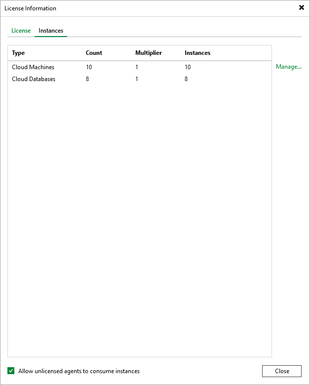

# Viewing License Information

After you add a backup appliance to the backup infrastructure, you can view the number of protected workloads in the Veeam Backup & Replication console.

Viewing License Details Using Veeam Backup & Replication Console

To view Veeam Plug-in for Microsoft Azure license details in the Veeam Backup & Replication console, open the main menu and select License.

The License tab of the License Information window provides general information on the currently installed Veeam Plug-in for Microsoft Azure license:

* Status — the license status. The status will depend on the license type, the number of days remaining until license expiration, the number of days remaining in the grace period (if any), and the number of workloads that exceeded the allowed increase limit (if any).
* Type — the license type (Perpetual, Subscription, Rental, Evaluation, NFR, Free).
* Edition — the license edition (Community, Standard, Enterprise, Enterprise Plus).
* Support ID — the ID of the contract (required for contacting Veeam Customer Support).
* Licensed to — the name of an organization to which the license was issued.
* Package — the software product for which the license was issued.
* Instances — the total number of license units included in the license file and the number of units consumed by protected workloads.
* Support expiration date — the date when the license will expire.

The Instances tab of the License Information window provides information on the currently protected workloads:

* Type — the type of protected workloads.

* Cloud VMs — protected Azure VMs.
* Cloud File Shares — protect Azure file shares.
* Cloud Databases — protected Azure SQL Servers and Cosmos DB accounts.

* Count — the number of protected workloads.
* Multiplier — the number of license units one protected workload consumes.
* Instances — the total number of the consumed license units.

Viewing License Details Using Veeam Backup for Microsoft Azure Web UI

To view details on the license that is currently installed on the backup appliance, do the following:

1. Switch to the Configuration page.
2. Navigate to Licensing > License Info.

The License Info tab provides general information on the Veeam Backup for Microsoft Azure license:

* Status — the license status. The status depends on the license edition, the number of days remaining until license expiration and the number of days remaining in the grace period (if any).
* Type — the license edition (Free, Managed).

* Instances — the total number of license units included in the license file and the number of units consumed by protected resources.

Each instance that has a restore point created in the past 31 days is considered to be protected and consumes one license unit. To view the list of instances that consume license units, switch to the License Usage tab.

|  |
| --- |
| Important |
| Starting from Veeam Backup for Microsoft Azure version 8, installing licenses is not supported for backup appliances that are not managed by any Veeam Backup & Replication servers. As a workaround, [install Veeam Plug-in for Microsoft Azure on a backup server](deploying_plug_in.md) and [add the appliance](adding_appliance_console.md) to the backup infrastructure. |

Related Topics

* [Removing License](license_remove.md)
* [Revoking License Units](license_revoke.md)

