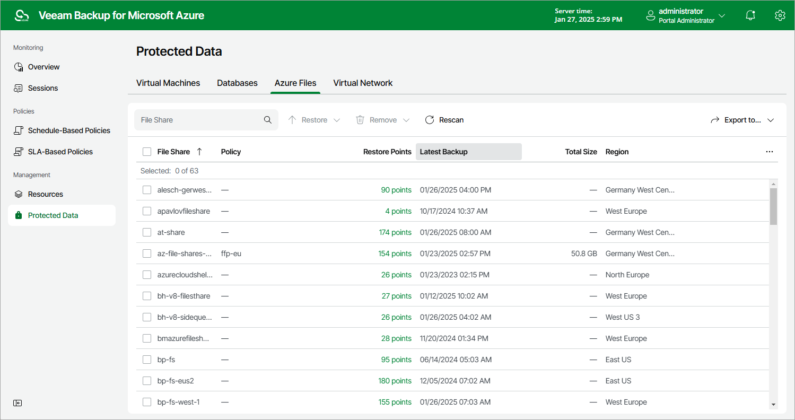

# Azure Files Data

After a backup policy successfully creates a restore point of an Azure file share according to the specified schedule, or after you create a snapshot of a file share manually, Veeam Backup for Microsoft Azure adds the file share to the resource list on the Protected Data page.

The Protected Data page displays Azure resources that are already protected by Veeam Backup for Microsoft Azure. Each resource is represented with a set of properties, such as:

* File Share — the name of the Azure file share.
* Policy — the name of the backup policy that protects the Azure file share.
* Restore Points — a number of restore points created for the Azure file share.

To view the list of restore points, click the link in the Restore Points column. The Available Restore Points window will display information on each restore point, including the following: the date when the restore point was created, the type of the restore point, and the configured retention policy settings (D — daily, W — weekly or M — monthly).

|  |
| --- |
| Note |
| Veeam Backup for Microsoft Azure displays all existing snapshots of Azure file share resources, not only snapshots created by the Veeam backup service. Azure file share snapshots created in Microsoft Azure Storage have the External snapshot type and cannot be deleted from the Veeam Backup for Microsoft Azure Web UI. |

* Latest Backup — the date and time of the most recent restore point created for the Azure file share.
* Total Size — the total size of the Azure file share backups.
* Region — an Azure region in which the Azure file share resides.
* Resource Group — the resource group to which the Azure file share belongs.
* Storage Account — an Azure storage account in which the Azure file share resides.

* File-level Recovery URL — a link to the file-level recovery browser.

The link appears when Veeam Backup for Microsoft Azure starts a restore session to [perform file-level recovery](fs_restore.md).

* Tenant ID — the unique identification number of the Microsoft Entra tenant that contains the Azure file share.
* Subscription ID — the unique identification number of the Azure subscription that manages the Azure file share.

On the Protected Data page, you can also perform the following actions:

* Remove restore points if you no longer need them. For more information, see [Removing File Share Snapshots](removing_fs_snapshots.md).
* Restore data of backed-up Azure file shares. For more information, see [File Share Restore](fs_restore.md).

|  |
| --- |
| Note |
| Consider that if you delete a file share from Microsoft Azure, the snapshots of this file share will be deleted as well. To protect your snapshots from accidental deletion, you can use the file share soft delete option. For more information on the soft delete option for Azure file shares, see [Microsoft Docs](https://docs.microsoft.com/en-us/azure/storage/files/storage-files-enable-soft-delete?tabs=azure-portal). |

