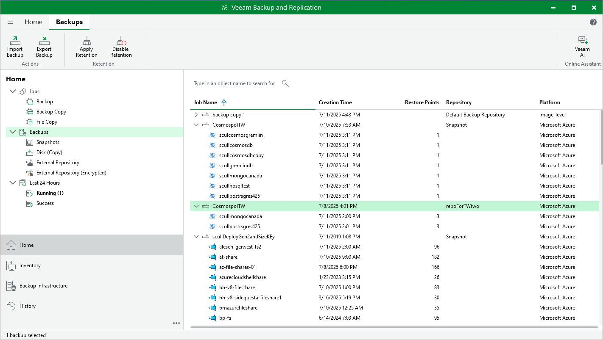
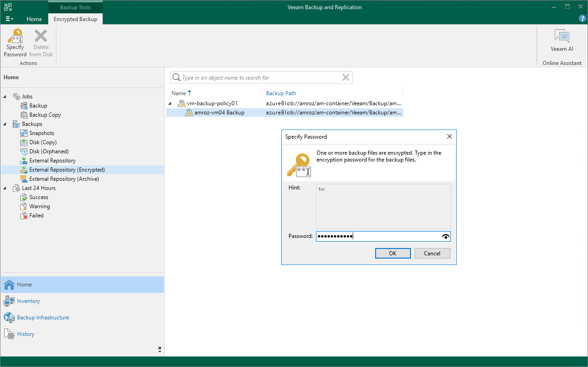

In this article

To view and manage backed-up data, navigate to the Backups node of the Home view. The node displays information on all restore points created by backup appliances.

|  |
| --- |
| Note |
| You cannot remove created image-level backups and snapshots from the Veeam Backup & Replication console. To remove restore points of Azure VMs, Azure SQL databases, Cosmos DB accounts, Azure file shares and Azure virtual network configurations, open the backup [appliance Web UI](accessing_vb_console.md) and follow the instructions provided in section [Managing Backed-Up Data Using Web UI](managing_backups_ui.md). |

When you expand the Backups node in the working area, you can see the following icons:

| Icon | Protected Workload |
| --- | --- |
|  | Indicates that the protected workload is an Azure VM. |
|  | Indicates that the protected workload is an Azure SQL database. |
|  | Indicates that the protected workload is a Cosmos DB account. |
|  | Indicates that the protected workload is an Azure file share. |
|  | Indicates that the protected workload is a virtual network configuration. |

The Backups node contains 4 subnodes:

* The Snapshots subnode displays information on cloud-native snapshots of the protected Azure VMs, Azure file shares and Azure virtual network configurations and cloud-native backups of the protected Cosmos DB accounts:

* <appliance\_name> nodes show snapshots created manually on the backup appliance and snapshots imported to the appliance from Azure regions specified in the backup policy settings.
* <backup\_policy\_name> nodes show snapshots and cloud-native backups created by the backup policy.

To learn how Veeam Backup for Microsoft Azure creates cloud-native snapshots of Azure VMs, Azure file shares and Azure virtual network configurations, see sections [Protecting Azure VMs](snapshot_chain_vm.md), [Protecting Azure Files](snapshot_chain_fs.md) and [Protecting Virtual Network Configurations](backup_chain_vnet.md). To learn how Veeam Backup for Microsoft Azure creates cloud-native backups of Cosmos DB accounts, see section [Protecting Cosmos DB Accounts](how_cosmos_db_backup_works.md).

* The External Repository subnode displays information on backups of the protected Azure VMs, Azure SQL databases and Cosmos DB accounts that are stored in standard repositories.

To learn how Veeam Backup for Microsoft Azure creates image-level backups of the Azure VMs and backups of Azure SQL databases and Cosmos DB accounts, see sections [Protecting Azure VMs](backup_chain_vm.md), [Protecting Azure SQL Databases](how_sql_backup_works.md) and [Protecting Cosmos DB Accounts](how_cosmos_db_backup_works.md#repository).

|  |
| --- |
| Note |
| If a backup chain was originally encrypted and then got decrypted by Veeam Backup & Replication, the backup chain will be marked with the Key icon. |

* The External Repository (Encrypted) subnode displays information on encrypted image-level backups of Azure VMs that are stored in standard repositories and that have not been decrypted yet, which means either that you have not specified the decryption password or that the specified password is invalid.

To learn how to decrypt backups, see [Decrypting Backups](#decrypt_image_level_backups).

* The External Repository (Archive) subnode displays information on backups of the protected Azure VMs, Azure SQL databases and Cosmos DB accounts that are stored in archive repositories.

To learn how Veeam Backup for Microsoft Azure creates archive backups, see section [Archive Backup Chain](archive_chain.md).

Decrypting Backups

Veeam Backup & Replication automatically decrypts backup files stored in repositories either using passwords that you specify when adding these repositories to the backup infrastructure or using Azure Key Vault cryptographic keys automatically detected by Veeam Backup & Replication. If you do not specify decryption passwords or Veeam Backup & Replication does not have permissions to access cryptographic keys, the backup files remain encrypted.

* To decrypt backup files encrypted using a cryptographic key, make sure that the service account specified when [creating a new repository](repository_console_service_account.md) or [adding an existing repository](adding_appliance_account.md) to the backup infrastructure is assigned permissions required to access Azure Key Vault cryptographic keys. For more information on the required permissions, see [Plug-In Permissions](plugin_permissions.md#azure_acc).
* To decrypt backup files encrypted using a password, do the following:

1. In the Veeam Backup & Replication console, open the Home view.
2. Navigate to Backups > External Repository (Encrypted).
3. Expand the backup policy that protects an Azure VM whose image-level backups you want to decrypt, select the backup chain that belongs to the VM and click Specify Password on the ribbon.

Alternatively, you can right-click the necessary backup chain and select Specify password.

|  |
| --- |
| Tip |
| To decrypt all backups created by a backup policy, right-click the policy and select Specify Password. |

1. In the Specify Password window, enter a password that was used to encrypt the data stored in the target repository.

Page updated 7/11/2025

Page content applies to build 8.0.1.202
