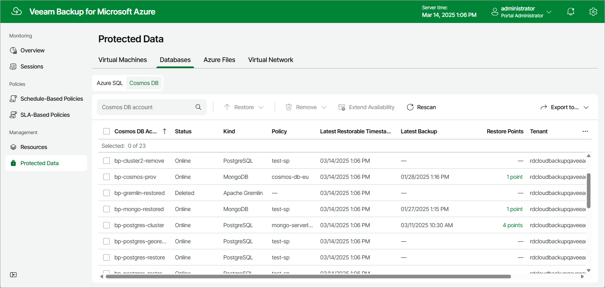

In this article

After a backup policy successfully creates a restore point of a Cosmos DB account according to the specified schedule, after Veeam Backup for Microsoft Azure runs a configuration session, or after you create a backup of a Cosmos DB for PostgreSQL or a Cosmos DB for MongoDB account manually, Veeam Backup for Microsoft Azure adds the database to the resource list on the Protected Data page.

The Protected Data page displays Azure resources that are already protected by Veeam Backup for Microsoft Azure. Each resource is represented with a set of properties, such as:

* Cosmos DB Account — the name of the protected Cosmos DB account.
* Status — the status of the protected Cosmos DB account.
* Kind — the API that was used to create the Cosmos DB account.
* Policy — the name of the backup policy that protects the Cosmos DB account.
* Latest Restorable Timestamp — the date and time of the most recent restorable timestamp created for the Cosmos DB account protected using the Continuous backup option.
* Latest Backup — the date and time of the most recent restore point created for the Cosmos DB for PostgreSQL or the Cosmos DB for MongoDB account protected using the Backup to repository option.
* Restore Points — a number of restore points created for the Cosmos DB for PostgreSQL or the Cosmos DB for MongoDB account protected using the Backup to repository option.

To view the list of restore points, click the link in the Restore Points column. The Available Restore Points window will display information on each restore point, including the following: the date when the restore point was created, the access tier of the repository where the restore point is stored, and the configured retention policy settings (D — daily, W — weekly, M — monthly or Y — yearly).

* Backup Size — the total size of the standard Cosmos DB account backups.
* Archive Size — the total size of the Cosmos DB account backups stored in archive repositories.

* Tenant — the name and the ID of the Microsoft Entra tenant that contains the Cosmos DB account.
* Subscription — the name and the ID of the Azure subscription that manages the Cosmos DB account.

* Resource Group — the resource group to which the Cosmos DB account belongs.
* Region — an Azure region in which the Cosmos DB account resides.

* Data Retrieval — the status of the backups retrieval from the archive repository.

On the Protected Data page, you can also perform the following actions:

* Remove restore points if you no longer need them. For more information, see [Removing Cosmos DB Backups](removing_cosmos_db_backups.md).
* Restore data of backed-up Cosmos DB accounts. For more information, see [Cosmos DB Restore](cosmos_db_restore.md).

Page updated 8/20/2025

Page content applies to build 8.0.1.202
