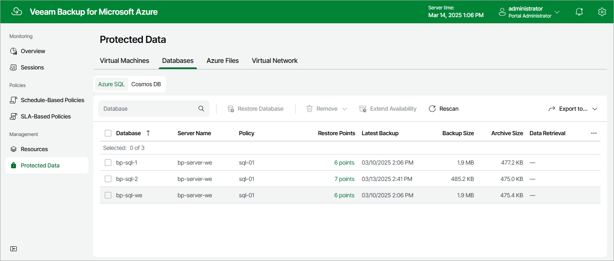

In this article

After a backup policy successfully creates a restore point of an Azure SQL database according to the specified schedule, or after you create a backup of a database manually, Veeam Backup for Microsoft Azure adds the database to the resource list on the Protected Data page.

The Protected Data page displays Azure resources that are already protected by Veeam Backup for Microsoft Azure. Each resource is represented with a set of properties, such as:

* Database — the name of the Azure SQL database.
* Server Name — the name of the SQL Server where the protected Azure SQL database is located.
* Policy — the name of the backup policy that protects the Azure SQL database.
* Restore Points — the number of restore points created for the Azure SQL database.

To view the list of restore points, click the link in the Restore Points column. The Available Restore Points window will display information on each restore point, including the following: the date when the restore point was created, the access tier of the repository where the restore point is stored, and the configured retention policy settings (D — daily, W — weekly, M — monthly or Y — yearly).

* Latest Backup — the date and time of the most recent restore point created for the Azure SQL database.

* Backup Size — the total size of the standard Azure SQL database backups.
* Archive Size — the total size of the Azure SQL database backups stored in archive repositories.

* Region — an Azure region in which the Azure SQL database resides.
* Resource Group — the resource group to which the Azure SQL database belongs.

* SQL Elastic Pool — the name of the elastic pool to which the Azure SQL database is added.

* Data Retrieval — the status of the backups retrieval from the archive repository.

* Tenant ID — the unique identification number of the Microsoft Entra tenant that contains the Azure SQL database.
* Subscription ID — the unique identification number of the Azure subscription that manages the Azure SQL database.

On the Protected Data page, you can also perform the following actions:

* Remove restore points if you no longer need them. For more information, see [Removing SQL Backups](removing_sql_backups.md).
* Restore data of backed-up Azure SQL databases. For more information, see [SQL Restore](sql_restore.md).

Page updated 8/20/2025

Page content applies to build 8.0.1.202
