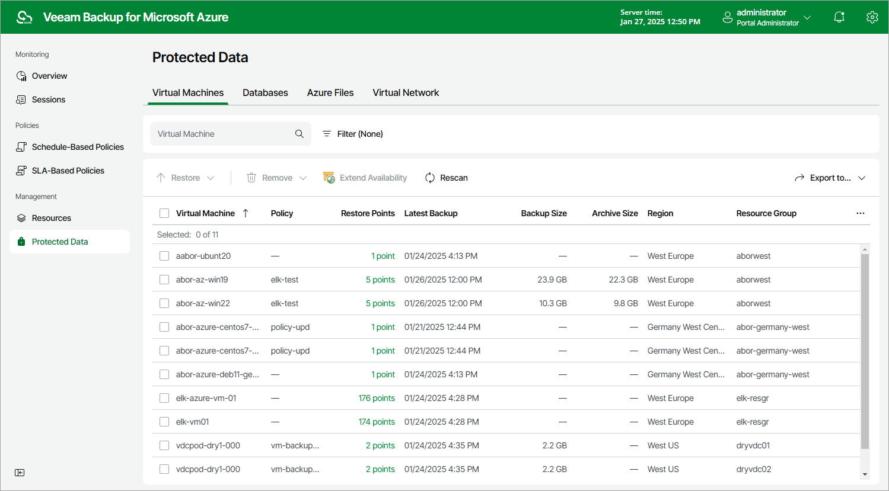

# Azure VM Data

After a backup policy successfully creates a restore point of an Azure VM according to the specified schedule, or after you create a snapshot of a VM manually, Veeam Backup for Microsoft Azure adds the VM to the resource list on the Protected Data page.

The Protected Data page displays Azure resources that are already protected by Veeam Backup for Microsoft Azure. Each resource is represented with a set of properties, such as:

* Virtual Machine — the name of the Azure VM.
* Policy — the name of the backup policy that protects the Azure VM.
* Restore Points — the number of restore points created for the Azure VM.

To view the list of restore points, click the link in the Restore Points column. The Available Restore Points window will display information on each restore point, including the following: the date when the restore point was created, the access tier of the repository where the restore point is stored, and the configured retention policy settings (D — daily, W — weekly, M — monthly or Y — yearly).

* Latest Backup — the date and time of the most recent restore point created for the Azure VM.

* Backup Size — the total size of the standard VM backups.
* Archive Size — the total size of the Azure VM backups stored in archive repositories.
* Region — an Azure region in which the Azure VM resides.
* Resource Group — the resource group to which the Azure VM belongs.
* VM Size — the VM size of the Azure VM.

* Operating System — the operating system running on the Azure VM.
* Data Retrieval — the status of the backups retrieval from the archive repository.

* File-level Recovery URL — a link to the file-level recovery browser.

The link appears when Veeam Backup for Microsoft Azure starts a restore session to [perform file-level recovery](performing_flr.md). The link contains a public DNS name of the worker instance hosting the file-level recovery browser and authentication information used to access this worker instance.

* Tenant ID — the unique identification number of the Microsoft Entra tenant that contains the Azure VM.
* Subscription ID — the unique identification number of the Azure subscription that manages the Azure VM.

On the Protected Data page, you can also perform the following actions:

* Remove restore points if you no longer need them. For more information, see [Removing Backups and Snapshots](removing_vm_backups_and_snapshots.md).
* Restore data of backed-up Azure VMs. For more information, see [VM Restore](vm_restore.md).

