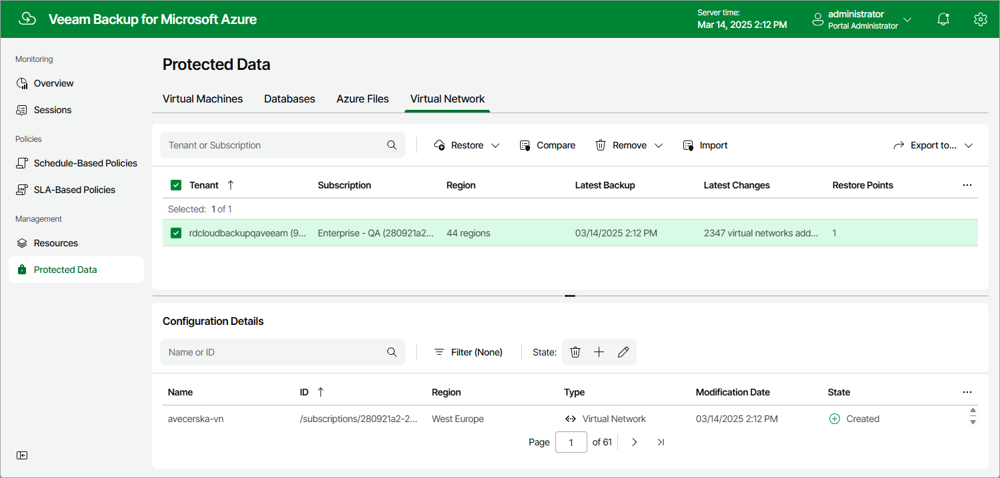

In this article

After the Virtual Network Configuration Backup policy successfully creates a restore point for the virtual network configuration of an Azure subscription within a Microsoft Entra tenant, the configuration record is automatically added to the resource list on the Protected Data page.

For each protected Azure subscription associated with the Microsoft Entra tenant, Veeam Backup for Microsoft Azure creates a configuration record in the database with the following set of properties:

* Tenant — a name of an Microsoft Entra tenant whose service account was used to collect the virtual network configuration data.
* Subscription — an Azure subscription whose virtual network configuration data is backed up.
* Region — a number of Azure regions in which the virtual network configuration data resides.
* Latest Backup — the date and time of the latest created restore point.
* Latest Changes — the summary of changes in the virtual network configuration in comparison with the previous restore point.
* Restore Points — a number of restore points created for the subscription.

On the Protected Data page, you can perform the following actions:

* Compare the items of the current virtual network configuration with the items stored in a backup. For more information, see [Comparing Virtual Network Configuration Backups](comparing_vnet_backups.md).
* Import all virtual network configuration backups stored in repositories to the Veeam Backup for Microsoft Azure database. For more information, see [Importing Virtual Network Configuration Data](importing_vnet_backups.md).
* Remove restore points if you no longer need them. For more information, see [Removing Virtual Network Configuration Backups](removing_vnet_backups.md).
* Restore data of backed-up virtual network configurations. For more information, see [Performing Virtual Network Configuration Restore Using Web UI](performing_vnet_restore_ui.md).

Related Topics

* [Removing Virtual Network Configuration Backups](removing_vnet_backups.md)
* [Comparing Virtual Network Configuration Backups](comparing_vnet_backups.md)

Page updated 3/14/2025

Page content applies to build 8.0.1.202
