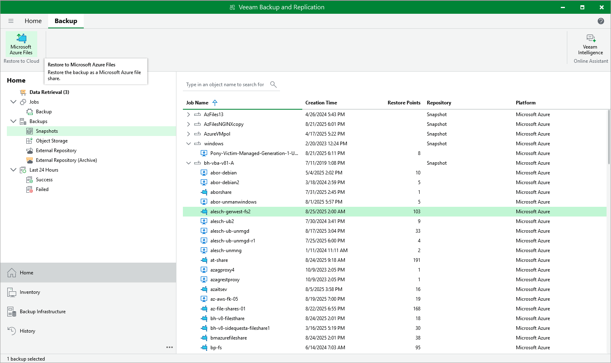

# Performing File Share Restore Using Console

You can recover corrupted or missing files of an Azure file share only using the backup appliance Web UI. However, you can launch the Azure Files File-level Recovery wizard directly from the Veeam Backup & Replication console to start the restore operation:

1. In the Veeam Backup & Replication console, open the Home view.
2. Navigate to Backups > Snapshots.
3. Expand the backup policy that protects the Azure file share that hosts files you want to recover, select the necessary file share and click Microsoft Azure Files on the ribbon.

Alternatively, you can right-click the selected file share and click Restore to Microsoft Azure Files.

Veeam Backup & Replication will open the Azure Files File-level Recovery wizard in a web browser. Complete the wizard as described in section [Performing File Share Restore Using Web UI](performing_fs_restore_ui.md).

