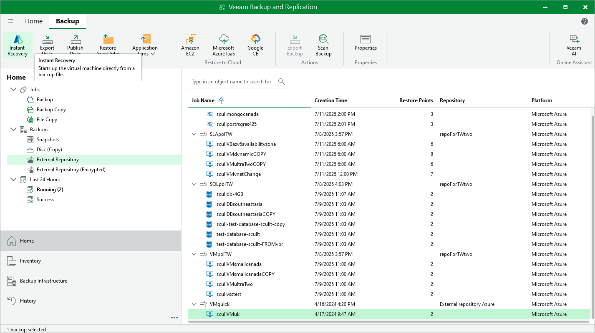

# Performing Instant Recovery

Veeam Backup & Replication allows you to use the Instant Recovery feature to restore Azure VMs from image-level backups to VMware vSphere and Microsoft Hyper-V environments, or to Nutanix AHV clusters. For more information, see the [Veeam Backup & Replication User Guide](https://helpcenter.veeam.com/docs/vbr/userguide/instant_recovery.html?ver=13) and [Veeam Backup for Nutanix AHV User Guide](https://helpcenter.veeam.com/docs/vbahv/userguide/instant_recovery_ahv.html?ver=8), section Instant Recovery.

|  |
| --- |
| Important |
| Instant Recovery cannot be performed using backups that are stored in [Veeam Data Cloud storage vaults](vdc_vaults.md). To perform this operation, use backups that are stored in standard backup repositories for which you have specified Microsoft Azure storage account credentials. To learn how to specify credentials for repositories, see sections [Creating New Repositories](repository_console_storage_account.md) and [Connecting to Existing Appliances](adding_appliance_repository.md). |

Before you start the restore operation, make sure to add to the backup infrastructure a vCenter Server, a Microsoft Hyper-V server, or a Nutanix AHV cluster that will manage restored VMs. To learn how to add servers or clusters to Veeam Backup & Replication, see the Veeam Backup & Replication User Guide, section [Adding VMware vSphere Servers](https://helpcenter.veeam.com/docs/vbr/userguide/add_vmware_server.html?ver=13), [Adding Microsoft Hyper-V Servers](https://helpcenter.veeam.com/docs/vbr/userguide/add_hyperv_server.html?ver=13) or [Adding Nutanix AHV Cluster](https://helpcenter.veeam.com/docs/vbahv/userguide/add_ahv_cluster.html?ver=50).

To perform Instant Recovery, do the following:

1. In the Veeam Backup & Replication console, open the Home view.
2. Navigate to Backups > External Repository.
3. Expand the backup policy that protects an Azure VM that you want to recover, select the necessary VM and click Instant Recovery on the ribbon.
4. Select VMware vSphere, Microsoft Hyper-V or Nutanix AHV.

1. Depending on the selected Instant Recovery option, complete the Instant Recovery wizard as described in the Veeam Backup & Replication User Guide, section [Performing Instant Recovery of Workloads to VMware vSphere VMs](https://helpcenter.veeam.com/docs/vbr/userguide/instant_recovery_vms_vm.html?ver=13), [Performing Instant Recovery of Workloads to Hyper-V VMs](https://helpcenter.veeam.com/docs/vbr/userguide/ir_workloads_hv.html?ver=13) or [Performing Instant Recovery of Workloads to Nutanix AHV](https://helpcenter.veeam.com/docs/vbahv/userguide/ir_workloads_ahv.html?ver=8).

