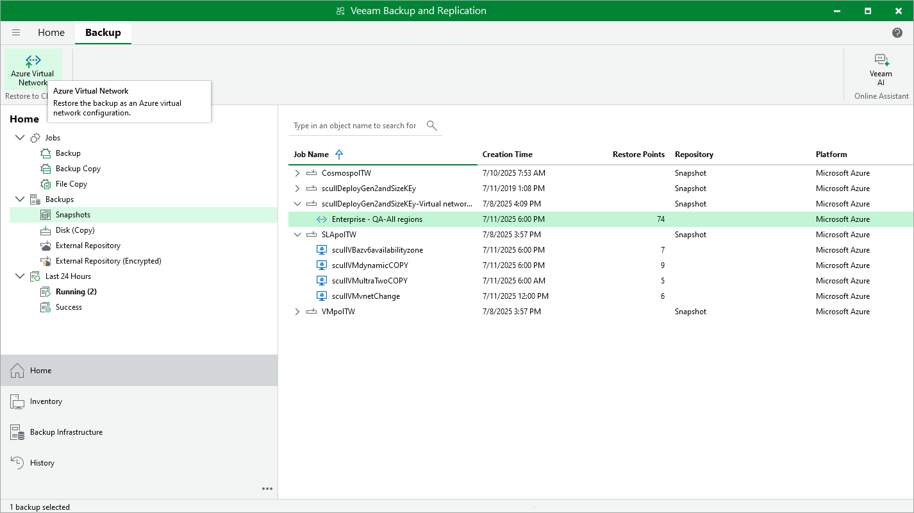

In this article

Veeam Backup & Replication allows you to restore the entire Azure virtual network configuration from a virtual network configuration backup to any available restore point. To learn how entire virtual network configuration restore works, see [Entire Virtual Network Configuration Restore](entire_vnet_restore_hiw.md).

To restore the virtual network configuration, do the following:

1. In the Veeam Backup & Replication console, open the Home view.
2. Navigate to Backups > Snapshots.
3. Expand the backup policy that protects the virtual network configuration, select the Azure subscription whose virtual network configuration you want to restore, and click Azure Virtual Network on the ribbon.

Alternatively, you can right-click the selected subscription and click Restore to Microsoft Azure virtual network.

Veeam Backup & Replication will open the Virtual Network Restore wizard in a web browser. Complete the wizard as described in section [Virtual Network Configuration Restore](entire_vnet_restore_point.md).

|  |
| --- |
| Important |
| Granular restore of the virtual network configuration is not available from the Veeam Backup & Replication console — you can perform it using the Veeam Backup for Microsoft Azure Web UI only. |

Page updated 8/26/2025

Page content applies to build 8.0.1.202
