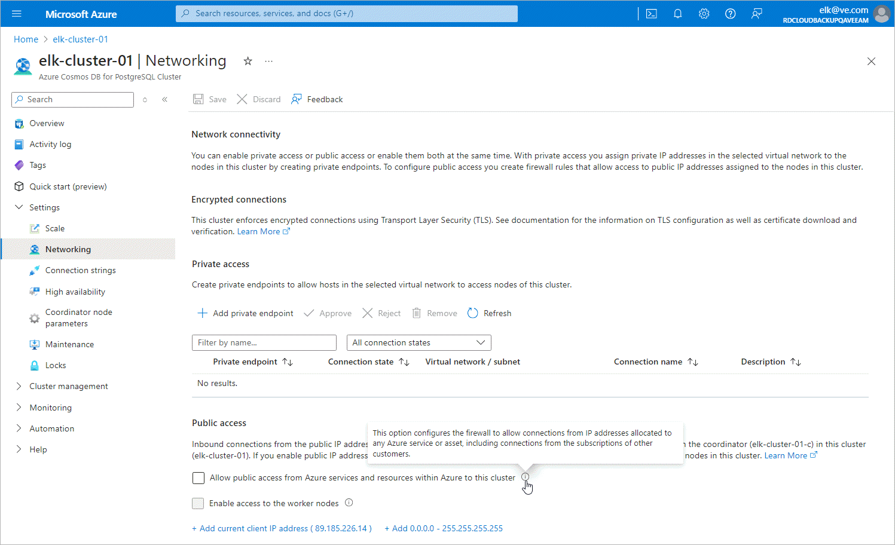

In this article

For the Cosmos DB for PostgreSQL account that you want to protect to be inaccessible through public network, you must disable public access to this account:

1. Log in to the [Microsoft Azure portal](https://portal.azure.com).
2. Click More services and select Resource groups on the All services page.
3. On the Resource groups page, select the resource group to which the necessary Cosmos DB for PostgreSQL cluster belongs. The resource group page will open.
4. In the Resource list, locate and click the cluster that you want to protect. The Azure Cosmos DB for PostgreSQL Cluster page will open.
5. Navigate to Settings > Networking.
6. In the Public access section, make sure the Allow public access from Azure services and resources within Azure to this cluster check box is not selected.

Page updated 6/27/2024

Page content applies to build 8.0.1.202
