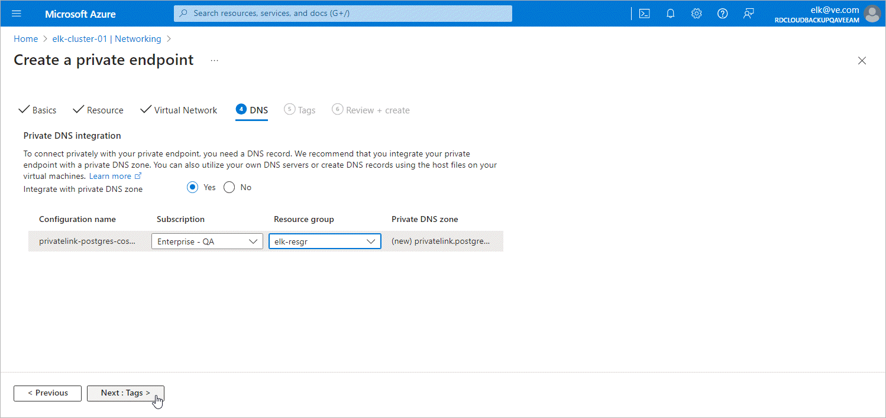

# Step 2e. Specify DNS Settings

At the DNS step of the Create a private endpoint wizard, do the following:

1. In the Private DNS integration section, navigate to the Integrate with private DNS zone field and click Yes.

1. From the Subscription and the Resource group drop-down lists, select the subscription and the resource group in which the private DNS zone will be created.

It is recommended that you create the DNS zones in the same resource group where the backup appliance resides, to simplify resource management.

1. Click Next: Tags >.

