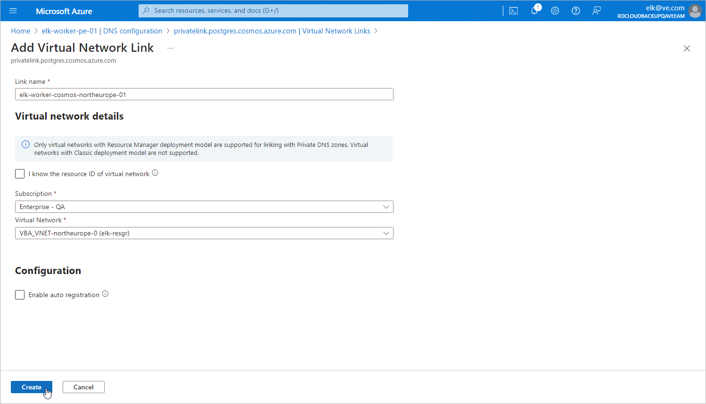

# Step 3. Configure Private Endpoints

To configure DNS settings for the private endpoints created at [step 2](pne_cosmos_db_endpoints.md), do the following:

1. In the Private access section of the Networking window of the Cosmos DB for PostgreSQL account for which you created the private endpoints, locate the private endpoint that you want to configure and click the link in the Private endpoint column.
2. In the Private endpoint window, navigate to Settings > DNS Configuration and click Add configuration.
3. In the Add DNS zone configuration window, do the following:

1. From the Subscription drop-down list, select the subscription where the DNS zone created at [step 2e](pne_cosmos_db_dns.md) resides.
2. From the Private DNS zone drop-down list, select the pair of the privatelink.postgres.cosmos.azure.com name and the resource group in which the DNS zone was created. Leave the default settings for the other options in this window.
3. Click Add.

1. In the private DNS zone, create an 'A' record for the private endpoint as described in [Microsoft Docs](https://learn.microsoft.com/en-us/azure/dns/dns-getstarted-portal#create-a-dns-record).
2. In the DNS configuration window, navigate to the newly created DNS configuration and click the in the Private DNS zone column.
3. In the Private DNS zone window, navigate to DNS Management > Virtual network links and click Add.
4. In the Add virtual network link window, add to the DNS zone links to VNets to which the worker instances are connected. To do that, perform the following steps for each VNet link:

1. In the Link name field, specify a name for the link.
2. From the Subscription drop-down list, select the subscription where the VNet resides.
3. From the Virtual network drop-down list, select the name of the VNet.
4. Click OK.

1. In the Virtual network links window, make sure that you have added links to all the necessary VNets.

