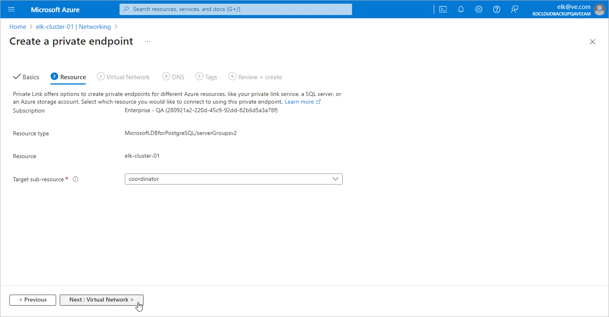

In this article

At the Resource step of the Create a private endpoint wizard, select coordinator from the Target sub-resource drop-down list and click Next: Virtual Network >.

Page updated 7/1/2024

Page content applies to build 8.0.1.202
