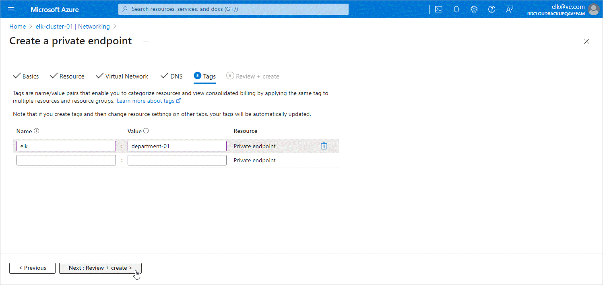

In this article

At the Targets step of the Create a private endpoint wizard, you can assign tags to the newly created private endpoint and private DNS zone if needed. Then, click Review + create >.

Page updated 7/1/2024

Page content applies to build 8.0.1.202
