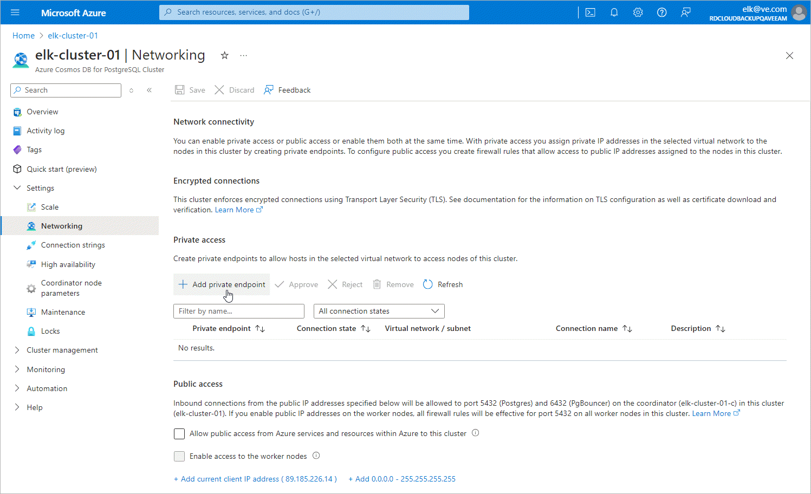

In this article

To launch the Create a private endpoint wizard for a Cosmos DB for PostgreSQL account for which you want to create a private endpoint, do the following:

1. Log in to the [Microsoft Azure portal](https://portal.azure.com).
2. Click More services and select Resource groups on the All services page.
3. On the Resource groups page, select the resource group to which the necessary Cosmos DB for PostgreSQL cluster belongs. The resource group page will open.
4. In the Resource list, locate and click the cluster that you want to protect. The Azure Cosmos DB for PostgreSQL Cluster page will open.
5. Navigate to Settings > Networking.
6. In the Private access section, click Add private endpoint.

Page updated 7/1/2024

Page content applies to build 8.0.1.202
