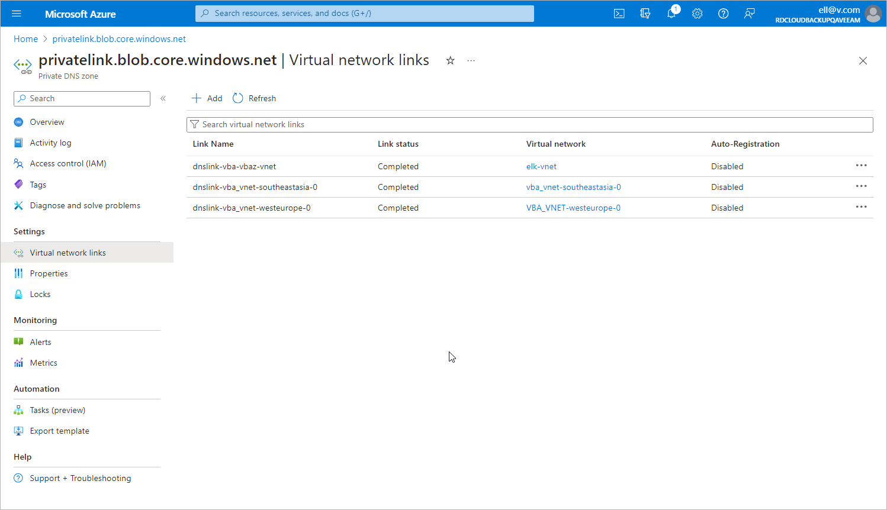

In this article

To configure DNS settings for the private endpoint that Veeam Backup for Microsoft Azure automatically created for [Azure Blob Storage](https://learn.microsoft.com/en-us/azure/storage/blobs/storage-blobs-overview), do the following:

1. In the Private endpoint connections tab of the Networking window of the Veeam storage account selected at [step 6a](pne_dns_endpoints_locate.md), locate the private endpoint created for Azure Blob Storage. To do that, click the link in the Private endpoint column. The private endpoint for Azure Blob Storage will have the blob value set in the Target sub-resource field.
2. In the Private endpoint window, navigate to Settings > DNS Configuration and click Add configuration.
3. In the Add DNS zone configuration window, do the following:

1. From the Subscription drop-down list, select the subscription where the DNS zones created at [step 1](app_pne_dns_zones.md) reside.
2. From the Private DNS zone drop-down list, select the pair of the privatelink.blob.core.windows.net name and the resource group in which the DNS zone was created. Leave the default settings for the other options in this window.
3. Click Add.

1. [This step applies only if you chose to create the private DNS zones manually at [step 1](app_pne_dns_zones.md)] In the private DNS zone, create an 'A' record for the added private endpoint as described in [Microsoft Docs](https://learn.microsoft.com/en-us/azure/dns/dns-getstarted-portal#create-a-dns-record).
2. In the DNS configuration window, navigate to the newly created DNS configuration and click the in the Private DNS zone column.
3. In the Private DNS zone window, navigate to DNS Management > Virtual network links and click Add.
4. In the Add virtual network link window, add to the DNS zone both the link to the VNet to which the backup appliance is connected and the links to the VNets to which the worker instances are connected. To do that, perform the following steps for each VNet link:

1. In the Link name field, specify a name for the link.
2. From the Subscription drop-down list, select the subscription where the VNet resides.
3. From the Virtual network drop-down list, select the necessary VNet.
4. Click OK.

|  |
| --- |
| Important |
| For application-aware processing, you must also add to the DNS zone the links to the VNets to which Azure VMs that you plan to protect are connected. |

1. In the Virtual network links window, make sure that you have added links to all the necessary VNets.

Page updated 4/23/2025

Page content applies to build 8.0.1.202
