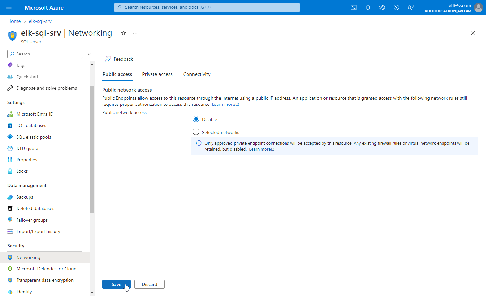

In this article

For the SQL Server that you want to protect to be inaccessible through public network, you must disable public access to this SQL Server:

1. Log in to the [Microsoft Azure portal](https://portal.azure.com).
2. Click More services and select Resource groups on the All services page.
3. On the Resource groups page, select the resource group to which the necessary SQL Server belongs. The resource group page will open.
4. In the Resource list, locate and click the SQL Server that you want to protect. The SQL server page will open.
5. Navigate to Security > Networking.
6. In the Public access tab, select the Disable option and click Save.

Page updated 4/26/2024

Page content applies to build 8.0.1.202
