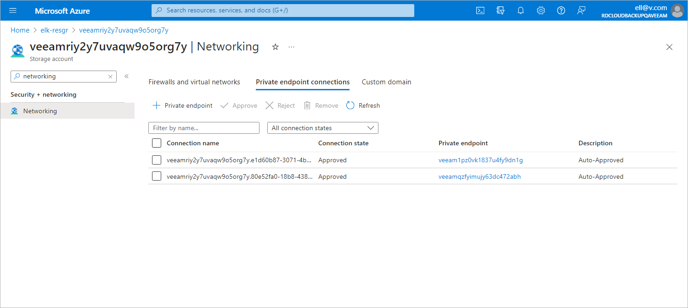

In this article

To locate the automatically created private endpoints, do the following:

1. Log in to the [Microsoft Azure portal](https://portal.azure.com).
2. Click More services and select Resource groups on the All services page.

1. On the Resource groups page, select the resource group to which the necessary storage account belongs. The resource group page will open.
2. In the Resources list, search for storage accounts that are assigned the Veeam backup appliance ID tag.
3. Click the necessary storage account. The Storage account page will open.
4. Navigate to Security + networking > Networking and switch to the Private endpoint connections tab.

Page updated 4/25/2024

Page content applies to build 8.0.1.202
