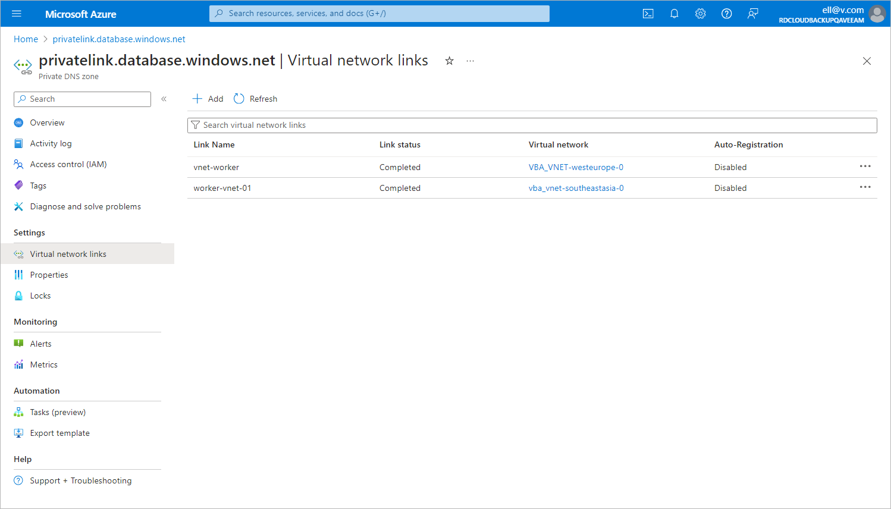

# Step 9. Configure Private Endpoint for SQL Server

[This step applies only if you chose to create and manage the private DNS zones manually at [step 1](pne_sql_dns_zones.md)]

To allow worker instances to save the backup to the repository in the private environment, you must add the private endpoint created at [step 8](app_pne_sql_endpoints.md) to the DNS zones created at [step 1](pne_sql_dns_zones.md). To do that:

1. Log in to the [Microsoft Azure portal](https://portal.azure.com).
2. Click More services and select Resource groups on the All services page.
3. On the Resource groups page, select the resource group to which the necessary SQL Server belongs. The resource group page will open.
4. In the Resource list, locate and click the SQL Server that you want to protect. The SQL Server page will open.
5. Navigate to Security > Networking.
6. In the Private access tab, navigate to the Private endpoint connections section and click the private endpoint created at [step 8](app_pne_sql_endpoints.md).
7. In the Private endpoint window, navigate to Settings > DNS Configuration and click Add configuration.
8. In the Add DNS zone configuration window, do the following:

1. From the Subscription drop-down list, select the subscription where the DNS zones created at [step 1](pne_sql_dns_zones.md) reside.
2. From the Private DNS zone drop-down list, select the pair of the privatelink.database.windows.net name and the resource group in which the DNS zone was created. Leave the default settings for the other options in this window.
3. Click Add.

1. In the private DNS zone, create an 'A' record for the private endpoint as described in [Microsoft Docs](https://learn.microsoft.com/en-us/azure/dns/dns-getstarted-portal#create-a-dns-record).
2. In the DNS configuration window, navigate to the newly created DNS configuration and click the link in the Private DNS zone column.
3. In the Private DNS zone window, navigate to DNS Management > Virtual network links and click Add.
4. In the Add virtual network link window, add to the DNS zone links to the VNets to which the worker instances are connected. To do that, perform the following steps for each VNet link:

1. In the Link name field, specify a name for the link.
2. From the Subscription drop-down list, select the subscription where the VNet resides.
3. From the Virtual network drop-down list, select the name of the VNet.
4. Click OK.

1. In the Virtual network links window, make sure that you have added links to all the necessary VNets.

