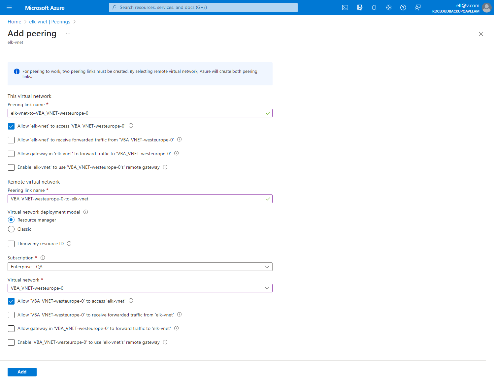

In this article

To allow Veeam Backup for Microsoft Azure components to communicate in the private environment, you must configure a peering connection between the the VNet to which the backup appliance is connected and the VNet to which worker instances are connected. To do that, perform the following steps:

1. Log in to the [Microsoft Azure portal](https://portal.azure.com).
2. Open the Resource group page.
3. In the Resource list, locate and click the VNet to which the backup appliance is connected. The Virtual network page will open.
4. Navigate to Settings > Peerings.
5. Click Add to open the Add peering page.
6. On the Add peering page, specify the following settings:

1. In the This virtual network section, specify a name for the peering link that will be added to the VNet to which the backup appliance is connected. Leave the default settings for the other options in this section.
2. In the Remote virtual network section, specify a name for the peering link that will be added to the target VNet. Leave the default settings for the other options in this section.
3. From the Subscription drop-down list, select an Azure subscription to which worker instances belong.

1. From the Virtual networks drop-down list, select the virtual network to which worker instances are connected.
2. Click Add.

Page updated 5/7/2025

Page content applies to build 8.0.1.202
