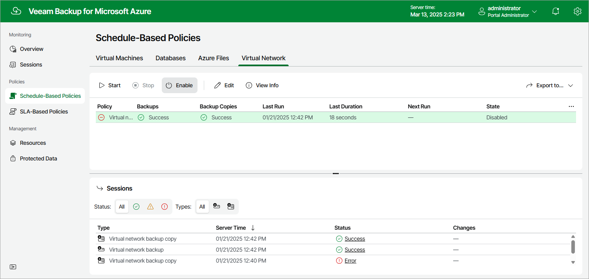

# Enabling and Disabling Virtual Network Configuration Backup Policy

By default, Veeam Backup for Microsoft Azure comes with the disabled Virtual Network Configuration Backup Policy. You can [manually start](policies_start_stop_vnet.md) or enable the disabled backup policy at any time you need.

To enable or disable the Virtual Network Configuration Backup policy, do the following:

1. Navigate to Policies > Virtual Network.
2. Click Enable or Disable.

