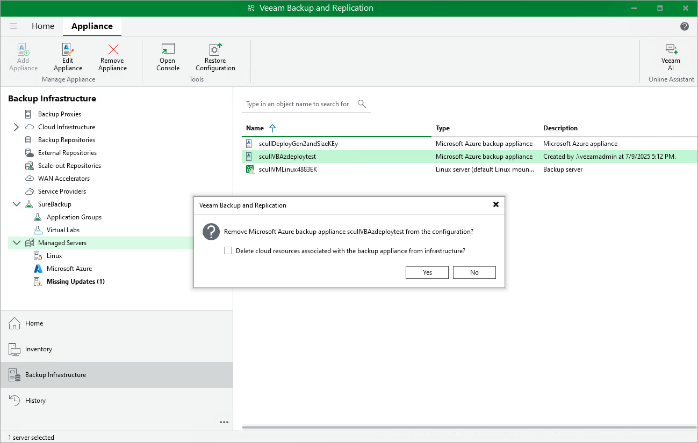

In this article

Veeam Plug-in for Microsoft Azure allows you to permanently remove backup appliances from the backup infrastructure.

Before You Begin

After you remove a backup appliance, the following limitations will apply:

* Repositories for which you have not specified Microsoft Azure storage account credentials will be removed from the backup infrastructure automatically.

Repositories for which you have specified Microsoft Azure storage account credentials will remain in the backup infrastructure. However, you will have to rescan the repositories to collect information on all newly created and recently deleted (both manually and by retention) restore points.

To learn how to specify credentials for repositories, see sections [Creating New Repositories](repository_console_storage_account.md) and [Connecting to Existing Appliances](adding_appliance_repository.md).

* You will not be able to manage backup policies created on the appliance.
* You will not be able to restore Azure VMs from snapshots.
* Restore to Microsoft Azure from image-level backups will start working as described in the Veeam Backup & Replication User Guide, section [How Restore to Microsoft Azure Works](https://helpcenter.veeam.com/docs/vbr/userguide/restore_azure_hiw.html?ver=13).

Also, the restore process will start taking more time to complete causing data transfer costs to increase as Veeam Backup & Replication will not be able to use native Microsoft Azure capabilities and will have to process more data.

How To Remove Backup Appliances

To remove a backup appliance, do the following:

1. In the Veeam Backup & Replication console, open the Backup Infrastructure view.
2. Navigate to Managed Servers.
3. Select the necessary backup appliance and click Remove Appliance on the ribbon.

Alternatively, right-click the appliance and select Remove.

1. In the Veeam Backup & Replication window, click Yes to acknowledge the operation.

|  |
| --- |
| Tip |
| If you want to remove an appliance from both the backup infrastructure and Microsoft Azure, select the Delete cloud resources associated with the backup appliance? check box in the opened window. Veeam Backup for Microsoft Azure will remove all resources associated with this appliance in Microsoft Azure.  However, if an appliance has been deployed from the Microsoft Azure Marketplace or is running Veeam Backup for Microsoft Azure version 2.x (or earlier), to remove resources from Microsoft Azure, you must follow the instructions provided in section [Uninstalling Backup Appliances Deployed from Microsoft Azure Marketplace](uninstalling_vb.md). |

|  |
| --- |
| Note |
| If the selected appliance has been deployed from the Veeam Backup & Replication console and Veeam Backup & Replication uses a [newly created key pair](deploying_guest_os_credentials.md) to authenticate against the backup appliance, you must remove the key pair from the [resource group that holds resources](deploying_appliance_subscription.md) related to the appliance. |

Page updated 12/16/2025

Page content applies to build 8.0.1.202
