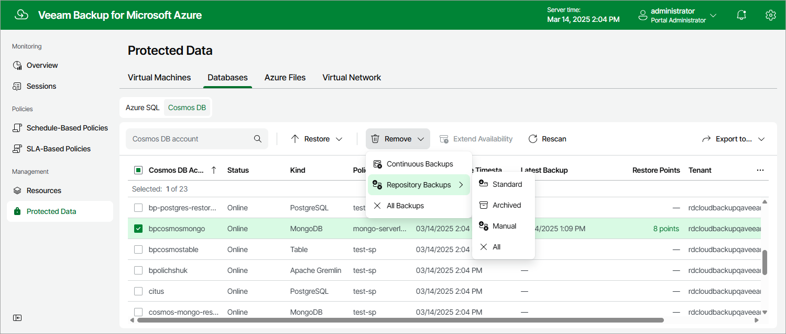

# Removing Cosmos DB Backups

Veeam Backup for Microsoft Azure applies the [configured retention policy settings](cosmos_db_backup_policy_schedule.md) to automatically remove backups created for Cosmos DB accounts by backup policies. If necessary, you can also remove the backed-up data manually.

To remove backed-up data manually, do the following:

1. Navigate to Protected Data > Databases > Cosmos DB.

1. Select Cosmos DB accounts whose data you want to remove.

1. Click Remove and select either of the following options:

* All — to remove all backups created for the selected Cosmos DB accounts both by backup policies and manually, including backups created using the Continuous backup option.
* Backups — to remove all backups created in repositories for the selected Cosmos DB for PostgreSQL or Cosmos DB for MongoDB accounts protected using the Backup to repository option.
* Archive — to remove all backups created in archive repositories for the selected Cosmos DB for PostgreSQL or Cosmos DB for MongoDB accounts protected using the Backup to repository option.
* Manual — to remove all backups created for the selected Cosmos DB for PostgreSQL or Cosmos DB for MongoDB accounts manually.

|  |
| --- |
| Note |
| When you select the All option, Veeam Backup for Microsoft Azure removes both backups created in repositories using the Backup to repository option and backups created in the configuration database using the Continuous backup option. However, the latter backups still remain in Microsoft Azure since they cannot be removed from the infrastructure on demand — Microsoft Azure removes these backups automatically upon expiration of the retention period. For more information, [Microsoft Docs](https://learn.microsoft.com/en-us/azure/cosmos-db/continuous-backup-restore-introduction). |

