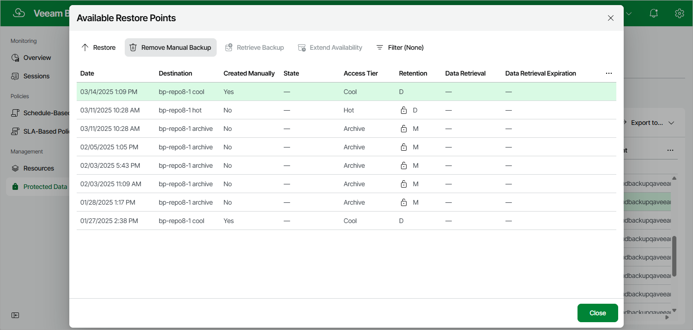

# Removing Cosmos DB Backups Created Manually

To remove all backups created for a Cosmos DB for PostgreSQL or Cosmos DB for MongoDB account manually, follow the instructions provided in [Removing Cosmos DB Backups](removing_cosmos_db_backups.md). If you want to remove a specific image-level backup created manually, do the following:

1. Navigate to Protected Data > Databases > Cosmos DB.
2. Select the check box next to the necessary Cosmos DB account, and click the link in the Restore Points column.
3. In the Available Restore Points window, select the necessary restore point and click Remove Manual Backup.

Related Topics

[Creating Cosmos DB Backups Manually](creating_cosmos_db_backups_manually.md)

