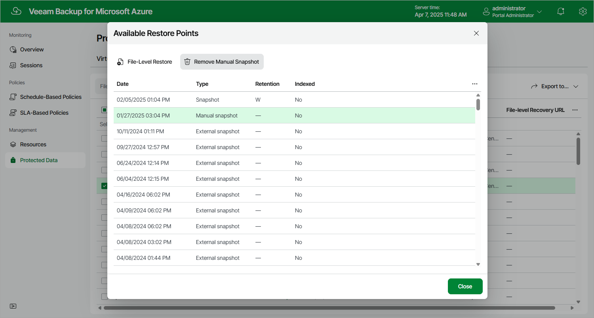

In this article

To remove all cloud-native snapshots created for a file share manually, follow the instructions provided in [Removing File Share Snapshots](removing_fs_snapshots.md). If you want to remove a specific cloud-native snapshot created manually, do the following:

1. Navigate to Protected Data > Azure Files.
2. Select the check box next to the necessary file share, and click the link in the Restore Points column.
3. In the Available Restore Points window, select the necessary snapshot and click Remove Manual Snapshot.

Related Topics

[Creating File Share Snapshots Manually](creating_fs_snapshots_manually.md)

Page updated 3/14/2025

Page content applies to build 8.0.1.202
