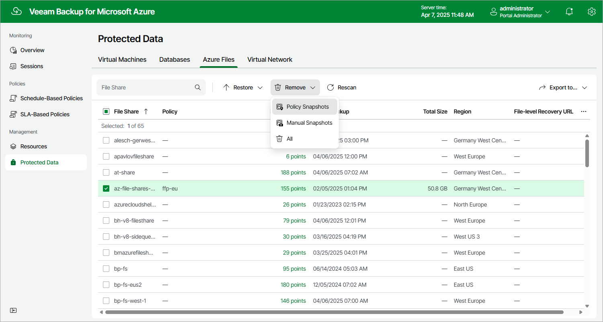

In this article

Veeam Backup for Microsoft Azure applies the [configured retention policy settings](fs_backup_policy_schedule.md) to automatically remove cloud-native snapshots created by backup policies. If necessary, you can also remove the backed-up data manually.

|  |
| --- |
| Note |
| In Veeam Backup for Microsoft Azure, you can remove only snapshots created by the Veeam backup service. To delete External snapshots, use Microsoft Azure portal as described in [Microsoft Docs](https://docs.microsoft.com/en-us/azure/storage/files/storage-files-quick-create-use-windows#delete-a-share-snapshot). |

To remove backed-up data manually, do the following:

1. Navigate to Protected Data > Azure Files.
2. Select Azure file shares whose data you want to remove.
3. Click Remove and select either of the following options:

* All — to remove all cloud-native snapshots created for the selected Azure file shares both by backup policies and manually.
* Policy Snapshots — to remove all cloud-native snapshots created for the selected Azure file shares by backup policies.
* Manual Snapshots — to remove all cloud-native snapshots created for the selected Azure file shares manually.

Page updated 3/14/2025

Page content applies to build 8.0.1.202
