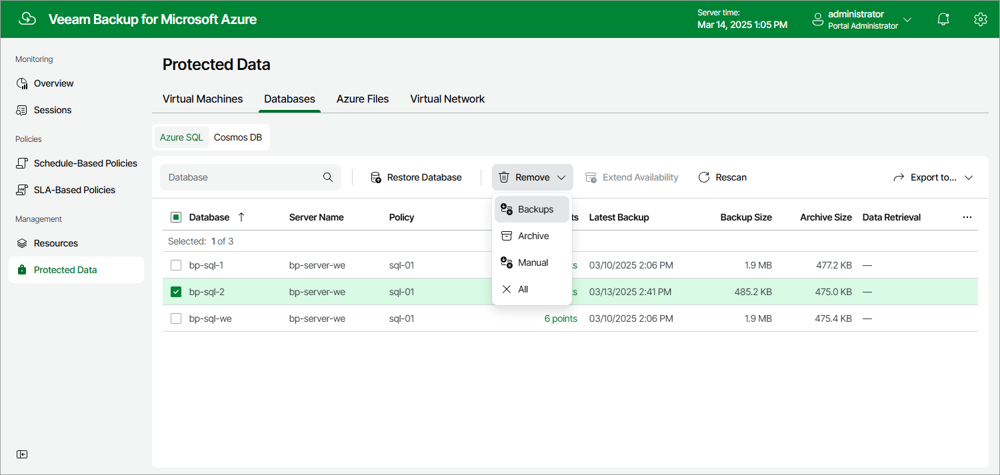

In this article

Veeam Backup for Microsoft Azure applies the [configured retention policy settings](sql_backup_policy_schedule.md) to automatically remove backups created for SQL databases by backup policies. If necessary, you can also remove the backed-up data manually.

|  |
| --- |
| Important |
| Do not delete backups from Microsoft Azure storage accounts in the Microsoft Azure portal. If some backup in a backup chain is missing, you will not be able to roll back Azure SQL database data to the necessary state. |

To remove backed-up data manually, do the following:

1. Navigate to Protected Data > Databases > Azure SQL.

1. Select Azure SQL databases whose data you want to remove.

1. Click Remove and select either of the following options:

* All — to remove all backups created for the selected Azure SQL databases both by backup policies and manually.
* Backups — to remove all backups created in repositories for the selected Azure SQL databases.
* Archive — to remove all backups created in archive repositories for the selected Azure SQL databases.
* Manual — to remove all backups created for the selected Azure SQL databases manually.

Page updated 8/20/2025

Page content applies to build 8.0.1.202
