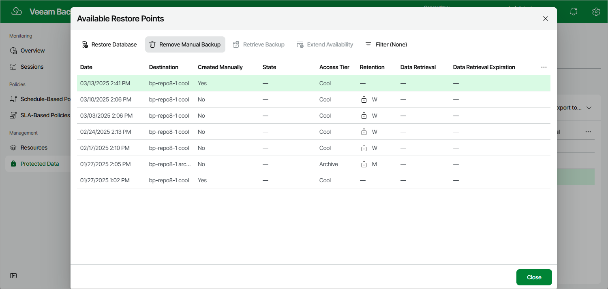

# Removing SQL Backups Created Manually

To remove all backups created for a SQL database manually, follow the instructions provided in [Removing SQL Backups](removing_sql_backups.md). If you want to remove a specific image-level backup created manually, do the following:

1. Navigate to Protected Data > Databases > Azure SQL.
2. Select the check box next to the necessary Azure SQL database, and click the link in the Restore Points column.
3. In the Available Restore Points window, select the necessary restore point and click Remove Manual Backup.

Related Topics

[Creating SQL Backups Manually](creating_sql_backups_manually.md)

