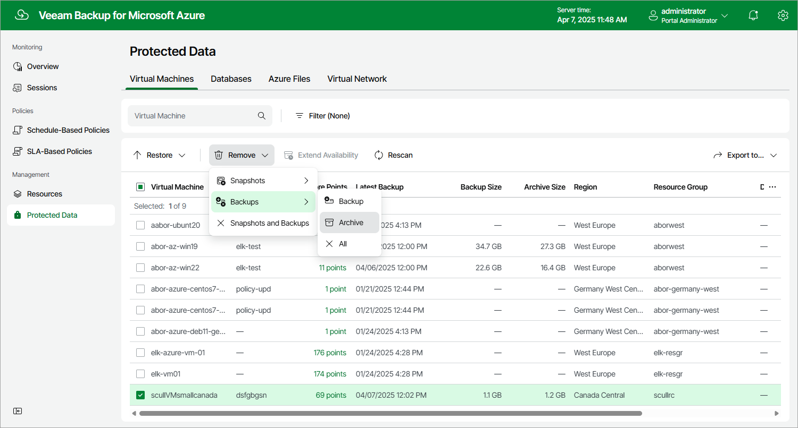

# Removing VM Backups and Snapshots

Veeam Backup for Microsoft Azure applies the [configured retention policy settings](vm_backup_policy_schedule.md) to automatically remove cloud-native snapshots and image-level backups created for Azure VMs by backup policies. If necessary, you can also remove the backed-up data manually.

|  |
| --- |
| Important |
| Do not delete backups from Microsoft Azure storage accounts in the Microsoft Azure portal. If some backup in a backup chain is missing, you will not be able to roll back Azure VM data to the necessary state. |

To remove backed-up data manually, do the following:

1. Navigate to Protected Data > Virtual Machines.
2. Select Azure VMs whose data you want to remove.
3. Click Remove and select either of the following options:

* Snapshots > All — to remove all cloud-native snapshots created for the selected Azure VMs both by backup policies and manually.
* Snapshots > Local — to remove all cloud-native snapshots created for the selected Azure VMs by backup policies.
* Snapshots > Manual — to remove all cloud-native snapshots created for the selected Azure VMs manually.
* Backups > All — to remove all image-level backups created for the selected Azure VMs.
* Backups > Backup — to remove all image-level backups created in repositories for the selected Azure VMs.
* Backups > Archive — to remove all image-level backups created in archive repositories for the selected Azure VMs.
* Snapshots and Backups — to remove both cloud-native snapshots and image-level backups created for the selected Azure VMs.

