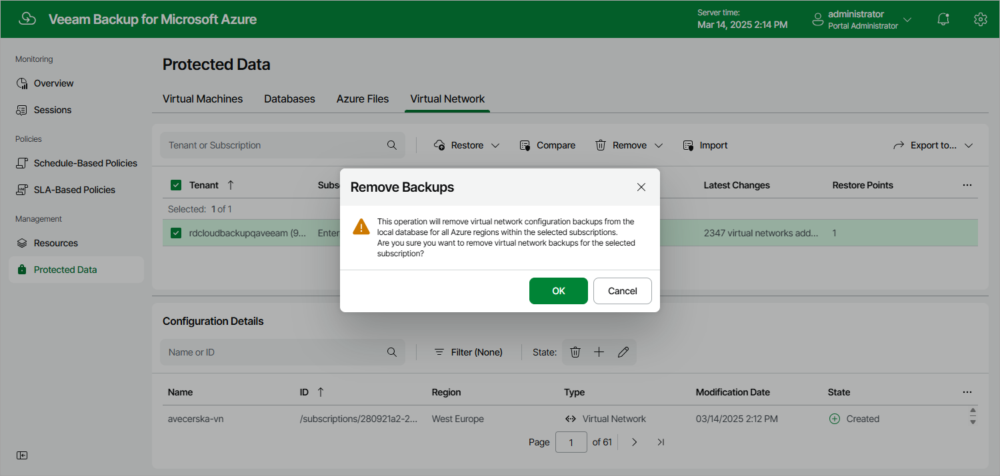

# Removing Virtual Network Configuration Backups

Veeam Backup for Microsoft Azure applies the [configured retention policy settings](vnet_backup_retention.md) to automatically remove virtual network configuration backups and backup copies created by the Virtual Network Configuration Backup policy. If necessary, you can also remove these backups manually — from the configuration database, from the repository or both. Keep in mind that:

* If a backup is removed from both the configuration database and the repository, you will no longer be able to use this backup to restore the virtual network configuration data.
* If a backup is removed from the repository but still exists in the configuration database, you will be able to use this backup to restore the virtual network configuration data.
* If a backup is removed from the configuration database but still exists in the repository, you will be able to use this backup to restore the virtual network configuration data — but you will first have to import it to the database as described in section [Importing Virtual Network Configuration Data](importing_vnet_backups.md).

To remove backed-up data manually, do the following:

1. Navigate to Protected Data > Virtual Network.
2. Select the configuration record for which you want to remove the backed-up data.

Each configuration record contains a whole set of all virtual network configuration backups created for an Azure subscription. Note that you cannot remove individual virtual network configuration items or specific backups.

1. Click Remove and select one of the following options:

* Backups — to remove all virtual network configuration backups for the selected configuration record from the Veeam Backup for Microsoft Azure database.
* Backup Copies — to remove all virtual network configuration backups of an Azure subscription from all repositories.
* All — to remove all virtual network configuration backups for the selected configuration record.

