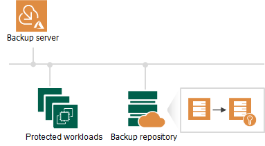

In this article

Veeam Backup for Microsoft Azure allows you to encrypt backed-up data in repositories (both backup repositories and Veeam Data Cloud storage vaults) using Veeam encryption mechanisms. Veeam Backup for Microsoft Azure encrypts backup files stored in repositories the same way as Veeam Backup & Replication encrypts backup files stored in backup repositories. To learn what algorithms Veeam Backup & Replication uses to encrypt backup files, see the Veeam Backup & Replication User Guide, section [Data Encryption](https://helpcenter.veeam.com/docs/vbr/userguide/data_encryption.html?ver=13).

To enable encryption for a backup repository or a Veeam Data Cloud storage vault added to Veeam Backup for Microsoft Azure, configure the repository settings as described in section [Adding Backup Repositories](repository_ui_encryption.md) or [Adding Storage Vaults](repository_vdc_ui_encryption.md) and choose whether you want to encrypt backed-up data using a password or an Azure Key Vault cryptographic key (available for backup repositories only). After you create a backup policy and specify the repository or vault as a target location for backed-up data as described in sections [Creating VM Backup Policies](vm_backup_policy_schedule.md), [Creating SQL Backup Policies](sql_backup_policy_schedule.md), [Creating Cosmos DB Backup Policies](cosmos_db_backup_policy_schedule.md) and [Editing Virtual Network Configuration Backup Policy](vnet_backup_copies.md), Veeam Backup for Microsoft Azure performs the following steps:

1. Based on the provided password or Azure Key Vault key, generates an encryption key to protect data stored in the repository, and stores the key in the configuration database on the backup appliance.
2. Uses the generated key to encrypt backed-up data transferred to the repository when running the backup policy.

Page updated 10/24/2025

Page content applies to build 8.0.1.202
