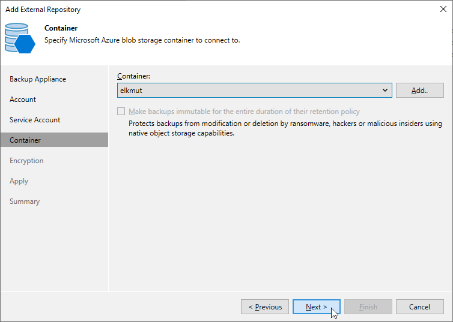

In this article

At the Container step of the wizard, do the following:

1. Choose whether you want to use an existing blob container or to create a new one as a target location for image-level backups of Azure VMs, backups of Azure SQL databases, backups of Cosmos DB for PostgreSQL and Cosmos DB for MongoDB accounts, and backup copies of virtual network configurations:

* To specify an existing container, select it from the Container drop-down list.

For a container to be displayed in list of available containers, it must be created for the [selected storage account](repository_console_storage_account.md) in Microsoft Azure as described in [Microsoft Docs](https://learn.microsoft.com/en-us/azure/storage/blobs/storage-quickstart-blobs-portal#create-a-container).

* To create a new container, click Add. In the New Container window, enter a name for the container. Veeam Backup & Replication will automatically create a container in the same region where the backup appliance resides.

|  |
| --- |
| Note |
| If you want to create the repository with immutability enabled, consider the following:   * Version-level immutability support must be enabled for the specified blob container. To learn how to enable version-level immutability support for blob containers, see [this Veeam KB article](https://www.veeam.com/kb4416). * If you choose to create a new container, note that Veeam Backup & Replication can create blob containers with version-level immutability support enabled only in storage accounts with blob versioning support enabled. |

1. If you want to protect backups stored in the repository from being lost as a result of malware, ransomware or any other malicious actions, you can create the repository with immutability settings enabled. To do that, you must select a Microsoft Azure storage account with [version-level immutability support](https://learn.microsoft.com/en-us/azure/storage/blobs/immutable-policy-configure-version-scope?tabs=azure-portal#enable-version-level-immutability-support-on-a-storage-account) or [blob versioning](https://learn.microsoft.com/en-us/azure/storage/blobs/versioning-enable?tabs=portal) enabled at [step 3](repository_console_storage_account.md) and a blob container with [version-level immutability support](https://learn.microsoft.com/en-us/azure/storage/blobs/immutable-policy-configure-version-scope?tabs=azure-portal#enable-version-level-immutability-for-a-new-container) enabled.

If the storage account and blob container meet the immutability requirements, the Make backups immutable for the entire duration of their retention policy check box will be automatically selected. For more information, see [Immutability](immutability.md).

|  |
| --- |
| Important |
| Consider the following:   * You cannot create standard repositories with the disabled immutability settings in blob containers with version-level immutability support enabled. * You cannot edit the configured immutability settings for the repository. |

Page updated 10/24/2025

Page content applies to build 8.0.1.202
