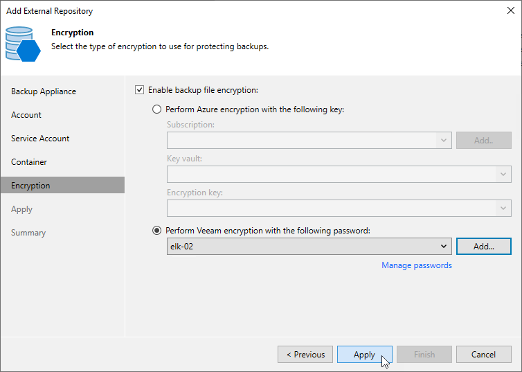

In this article

At the Encryption step of the wizard, choose whether you want to encrypt backups stored in the created repository.

|  |
| --- |
| Important |
| After you create a repository with encryption enabled, you can no longer disable encryption for this repository. However, you will be able to change encryption settings as described in section [Editing Repository Settings](repository_edit.md). |

If you select the Enable backup file encryption check box, also choose whether you want to use a password or an Azure Key Vault cryptographic key to encrypt the backed-up data:

* To encrypt data using a cryptographic key, select the Perform Azure encryption with the following key option and do the following:

1. From the Subscription drop-down list, select an Azure subscription to which the Key Vault belongs.

For a subscription to be displayed in the list of available subscriptions, it must be [created in Microsoft Azure](https://learn.microsoft.com/en-us/azure/cost-management-billing/manage/create-subscription) and [associated with the Microsoft Entra tenant](https://docs.microsoft.com/en-us/azure/active-directory/fundamentals/active-directory-how-subscriptions-associated-directory) to which the service account specified at [step 4](repository_console_service_account.md) belongs.

1. From the Key vault drop-down list, select the Azure Key Vault where the encryption key is stored.

For an Azure Key Vault to be displayed in the list of available vaults, it must be created in Microsoft Azure as described in [Microsoft Docs](https://learn.microsoft.com/en-us/azure/key-vault/general/quick-create-portal#create-a-vault).

|  |
| --- |
| Important |
| To list Azure Key Vaults and cryptographic keys and further to decrypt backups stored in the repository, Veeam Backup & Replication uses permissions of the service account specified at [step 4](repository_console_service_account.md). For more information on the required permissions, see [Plug-In Permissions](plugin_permissions.md#azure_acc). |

1. From the Encryption key drop-down list, select the necessary cryptographic key.

For a cryptographic key to be displayed in the list of available encryption keys, it must be created in Microsoft Azure as described in [Microsoft Docs](https://learn.microsoft.com/en-us/azure/key-vault/secrets/quick-create-portal#add-a-secret-to-key-vault).

* To encrypt data using a password, select the Perform Veeam encryption with the following password option and choose the necessary password from the drop-down list.

For a password to be displayed in the list of available passwords, it must be added to the Veeam Backup & Replication as described in the Veeam Backup & Replication User Guide, section [Creating Passwords](https://helpcenter.veeam.com/docs/vbr/userguide/password_manager_create.html?ver=13). If you have not added the necessary password beforehand, you can do it without closing the Add External Repository wizard. To do that, click either the Manage passwords link or the Add button, and specify the password and hint in the Password window.

|  |
| --- |
| Important |
| If you want to use an Azure Key Vault cryptographic key for encryption at the repository level, consider the following:   * Do not disable cryptographic keys specified in the repository settings. Otherwise, Veeam Backup for Microsoft Azure will not be able to encrypt data, and backup policies that use the encrypted repository for storing backups will fail. * Do not delete cryptographic keys specified in the repository settings. Otherwise, Veeam Backup for Microsoft Azure will not be able to decrypt data stored in the repository. |

Page updated 8/20/2025

Page content applies to build 8.0.1.202
