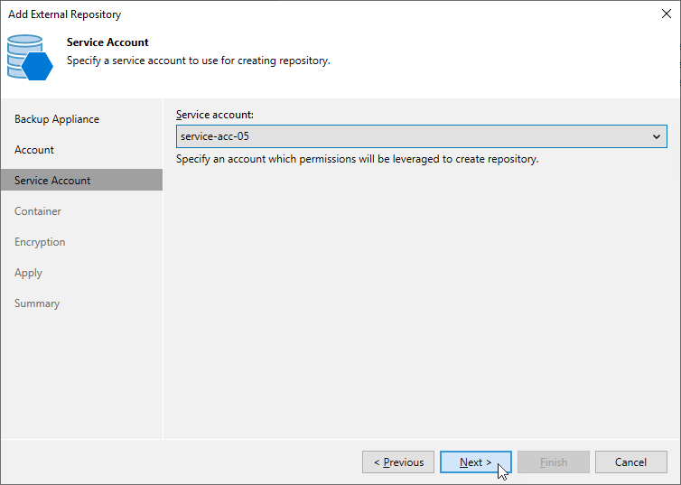

In this article

At the Service Account step of the wizard, specify a service account whose permissions Veeam Backup for Microsoft Azure will use to access the Microsoft Azure storage account specified at [step 3](repository_console_storage_account.md).

For a service account to be displayed in the Service account list, it must be added to the backup appliance as described in section [Adding Service Accounts](service_account_add.md).

Page updated 8/20/2025

Page content applies to build 8.0.1.202
