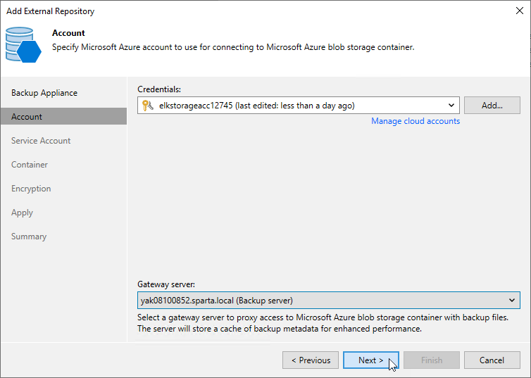

# Step 3. Configure Repository Settings

At the Account step of the wizard, do the following:

1. From the Credentials drop-down list, select credentials of a Microsoft Azure storage account in which the repository will reside. Veeam Backup & Replication will use these credentials to access the repository. For more information on supported types of storage accounts, see the Veeam Backup & Replication User Guide, section [Cloud Credentials Manager](https://helpcenter.veeam.com/docs/vbr/userguide/cloud_credentials_azure_storage.html?ver=13).

|  |
| --- |
| Important |
| Note that the Enable storage account key access option must be enabled in the storage account settings for Shared Key authorization. For more information, see [Microsoft Docs](https://learn.microsoft.com/en-us/azure/storage/common/storage-account-keys-manage?toc=%2Fazure%2Fstorage%2Fblobs%2Ftoc.json&bc=%2Fazure%2Fstorage%2Fblobs%2Fbreadcrumb%2Ftoc.json&tabs=azure-portal). |

For credentials to be displayed in the list of available credentials, they must be added to the Cloud Credentials Manager as described in the Veeam Backup & Replication User Guide, section [Microsoft Azure Storage Accounts (Shared Key)](https://helpcenter.veeam.com/docs/vbr/userguide/cloud_credentials_azure_storage.html?ver=13). If you have not added the necessary credentials to the Cloud Credentials Manager beforehand, you can do it without closing the Add External Repository wizard. To do that, click either the Manage cloud accounts link or the Add button, and specify the storage account name and access key generated for the account in the Credentials window.

|  |
| --- |
| Note |
| If you want to create the repository with immutability enabled, make sure that the specified storage account is configured as described in [this Veeam KB article](https://www.veeam.com/kb4416). |

1. [Applies only if you choose to create a standard repository] From the Gateway server drop-down list, select a gateway server that will be used to access the repository.

For a server to be displayed in the Gateway server list, it must be added to the backup infrastructure. For more information on gateway servers, see [Gateway Servers](gateway_servers.md).

